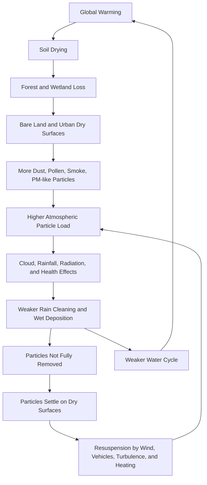

# Atmospheric Particle Saturation and Resuspension Loop

## A Technical Note on Aerosols, Dry Surfaces, Rainfall, and Natural Cooling Feedbacks

This document defines the **Atmospheric Particle Saturation and Resuspension Loop** as a key overlooked mechanism in discussions of Stratospheric Aerosol Injection (SAI).

The concept explains how warming, drying, soil degradation, forest loss, wetland loss, and weakened rainfall can increase atmospheric particle persistence and resuspension.

---

## 1. Definition

The Atmospheric Particle Saturation and Resuspension Loop is a feedback structure in which land degradation and hydrological disruption increase airborne particle load, while weakened rain-cleaning and dry surfaces allow particles to remain in circulation or rise again after deposition.

In simplified form:

```text
warming
→ drying
→ vegetation and wetland loss
→ more particle emission
→ weaker wet deposition
→ more resuspension from dry surfaces
→ elevated atmospheric particle load
→ changes in clouds, rainfall, radiation, and health
→ further weakening of water circulation and natural cooling
```

---

## 2. Why This Matters for SAI

SAI often begins with a simplified assumption:

```text
volcanic sulfate aerosols caused temporary cooling
→ artificial sulfate aerosols may also cool the planet
```

However, this ignores the current atmospheric particle context.

The atmosphere is not empty before SAI begins.

It already contains:

```text
dust
sand
smoke
soot
sea salt
pollen
spores
PM2.5
mineral particles
biogenic particles
combustion particles
mixed complex aerosols
```

SAI would not be added to a clean experimental chamber.

It would be added to an already complex and stressed atmospheric particle system.

---

## 3. Wet Deposition as Atmospheric Cleaning

Wet deposition is the process by which rain, snow, fog, or cloud droplets remove particles and soluble substances from the atmosphere.

For the purposes of this framework, rainfall is treated as Earth's atmospheric cleaning system.

Rain can:

```text
capture airborne particles
remove dust and pollen
reduce smoke and fine particle load
transport particles to soils, rivers, wetlands, and oceans
support surface moisture and particle fixation
```

When rainfall weakens or becomes highly localized, atmospheric cleaning becomes less reliable.

---

## 4. Surface Fixation After Deposition

Removing particles from the air is not enough.

After deposition, particles must be captured by surface systems.

Effective natural particle traps include:

```text
moist soils
humus layers
wetlands
forests
leaf surfaces
grasslands
rivers
lakes
oceans
microbial soil structures
plant root zones
```

These systems reduce the probability that deposited particles will return to the atmosphere.

When these systems are lost, particles remain loose and dry.

---

## 5. Resuspension from Dry Surfaces

Resuspension occurs when particles that have already settled are lifted again into the air.

Common drivers include:

```text
wind
vehicle movement
dry soil surfaces
bare land
surface heating
turbulence
agricultural disturbance
construction dust
road dust
desertification
vegetation loss
```

In a drying world, resuspension becomes more important.

A particle that falls onto wet humus may become fixed.

A particle that falls onto dry road dust, bare soil, or degraded land may return to the air.

---

## 6. Feedback Loop Diagram



---

## 7. Implications for Climate Intervention

Aerosol-based climate intervention must answer the following:

```text
Is the atmosphere already particle-loaded?
Are existing particles being removed efficiently?
Are dry surfaces causing chronic resuspension?
Are wetlands, forests, soils, rivers, and oceans still functioning as particle traps?
Will additional aerosols disturb rainfall or wet deposition?
Will added particles interact with existing dust, soot, smoke, pollen, or PM2.5?
Could additional aerosol layers alter outgoing heat release?
```

Without these answers, SAI cannot be responsibly described as cooling.

---

## 8. Relation to Water-Cycle Cooling

Earth's natural cooling depends heavily on water phase transitions.

Water cools the planet through:

```text
evaporation
transpiration
cloud formation
rainfall
soil moisture
wetlands
river flow
ocean circulation
latent heat transport
```

If SAI does not restore these processes, it does not repair the cooling system.

It only modifies part of the radiation pathway.

---

## 9. Relation to Cooling Credit

The Cooling Credit framework evaluates measurable cooling and restoration of natural cooling feedbacks.

A valid Cooling Credit intervention should improve:

```text
actual heat-load reduction
soil moisture
plant evapotranspiration
rainwater circulation
wet deposition
surface particle fixation
forest cooling
wetland recovery
ocean circulation
natural cooling feedbacks
```

SAI, by itself, does not satisfy these criteria.

---

## 10. Conclusion

The Atmospheric Particle Saturation and Resuspension Loop shows why SAI should not be treated as a simple planetary cooling tool.

The atmosphere already contains many particles.

Rain cleaning may be weakened.

Dry surfaces may re-lift deposited particles.

Natural particle traps may be degraded.

Under these conditions, adding more aerosols could increase complexity and risk rather than restore the Earth's cooling system.

The priority should be to restore rain, moist soils, forests, wetlands, rivers, oceans, microorganisms, and natural cooling feedbacks.

---

## Core Statement

> The atmosphere is not an empty laboratory.  
> Shading is not cooling.  
> Cooling means restoring planetary circulation.

---

## License

CC BY 4.0
