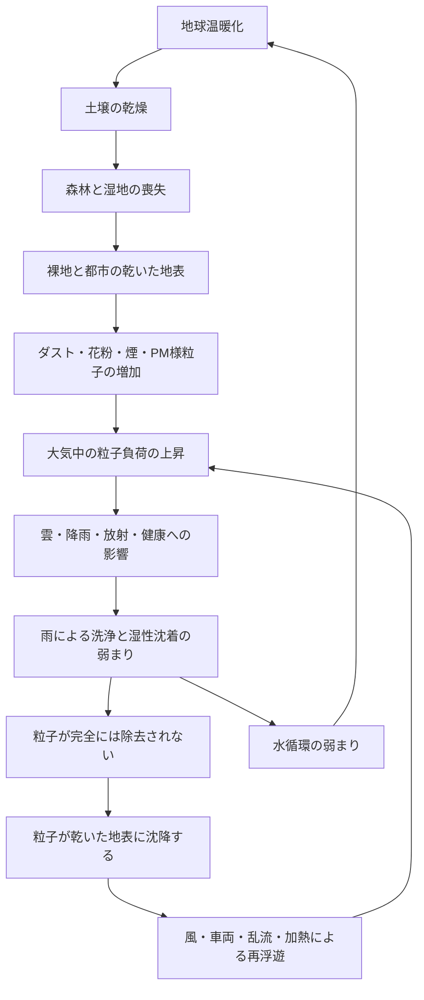

# 大気中の粒子の飽和と再浮遊のループ

[English Version](ATMOSPHERIC_PARTICLE_RESUSPENSION_LOOP.md)

## エアロゾル、乾いた地表、降雨、自然の冷却フィードバックに関する技術ノート

本文書は、**大気中の粒子の飽和と再浮遊のループ（Atmospheric Particle Saturation and Resuspension Loop）**を、成層圏エアロゾル注入（SAI）をめぐる議論で見落とされている、重要なメカニズムとして定義します。

この概念は、温暖化、乾燥、土壌の劣化、森林の喪失、湿地の喪失、弱まった降雨が、大気中の粒子の持続と再浮遊をどのように増やしうるかを説明します。

---

## 1. 定義

大気中の粒子の飽和と再浮遊のループとは、土地の劣化と水文の乱れが空中の粒子の負荷を増やし、一方で、弱まった雨による洗浄と乾いた地表のために、粒子が循環に留まり続けるか、沈着の後に再び舞い上がる、というフィードバックの構造です。

簡略化して示すと、

```text
温暖化
→ 乾燥
→ 植生と湿地の喪失
→ 粒子の放出の増加
→ 湿性沈着の弱まり
→ 乾いた地表からの再浮遊の増加
→ 大気中の粒子負荷の上昇
→ 雲、降雨、放射、健康への変化
→ 水循環と自然の冷却のさらなる弱体化
```

---

## 2. なぜこれがSAIにとって重要か

SAIはしばしば、単純化した前提から出発します。

```text
火山性の硫酸塩エアロゾルが一時的な冷却を引き起こした
→ 人工の硫酸塩エアロゾルも、地球を冷却するかもしれない
```

しかし、これは現在の大気中の粒子の文脈を無視しています。

SAIが始まる前でも、大気は空っぽではありません。

すでに、次のものを含んでいます。

```text
ダスト（塵）
砂
煙
すす
海塩
花粉
胞子
PM2.5
鉱物粒子
生物起源の粒子
燃焼粒子
混合した複合エアロゾル
```

SAIは、きれいな実験室に加えられるのではありません。

すでに複雑で、ストレスを受けた大気中の粒子システムに、加えられるのです。

---

## 3. 大気の洗浄としての湿性沈着

湿性沈着とは、雨、雪、霧、雲粒が、大気から粒子や可溶性の物質を取り除くプロセスです。

このフレームワークの目的では、降雨は、地球の大気の洗浄システムとして扱われます。

雨は、次のことをします。

```text
空中の粒子を捕捉する
ダストと花粉を取り除く
煙と微粒子の負荷を減らす
粒子を土壌、河川、湿地、海洋へ運ぶ
地表の水分と粒子の固定を支える
```

降雨が弱まる、あるいは極めて局所化すると、大気の洗浄は信頼性が低くなります。

---

## 4. 沈着後の地表での固定

粒子を空気から取り除くだけでは十分ではありません。

沈着の後、粒子は地表のシステムに捕捉されなければなりません。

効果的な自然の粒子トラップには、次のものがあります。

```text
湿った土壌
腐植層
湿地
森林
葉の表面
草原
河川
湖沼
海洋
微生物がつくる土壌構造
植物の根圏
```

これらのシステムは、沈着した粒子が大気に戻る確率を下げます。

これらのシステムが失われると、粒子は緩く乾いたままになります。

---

## 5. 乾いた地表からの再浮遊

再浮遊とは、すでに沈降した粒子が、再び空気中に持ち上げられることです。

一般的な要因には、次のものがあります。

```text
風
車両の移動
乾いた土壌の表面
裸地
地表の加熱
乱流
農業による撹乱
建設による粉じん
道路の粉じん
砂漠化
植生の喪失
```

乾燥する世界では、再浮遊はより重要になります。

湿った腐植に落ちた粒子は、固定されるかもしれません。

乾いた道路の粉じん、裸地、劣化した土地に落ちた粒子は、空気中に戻るかもしれません。

---

## 6. フィードバックループの図



---

## 7. 気候介入への含意

エアロゾルに基づく気候介入は、次の問いに答えなければなりません。

```text
大気は、すでに粒子で満たされていないか？
既存の粒子は、効率的に除去されているか？
乾いた地表が、慢性的な再浮遊を引き起こしていないか？
湿地、森林、土壌、河川、海洋は、まだ粒子トラップとして機能しているか？
追加のエアロゾルは、降雨や湿性沈着を乱さないか？
追加の粒子は、既存のダスト、すす、煙、花粉、PM2.5と相互作用しないか？
追加のエアロゾル層が、外向きの熱放出を変えないか？
```

これらの答えがなければ、SAIを責任ある形で「冷却」と呼ぶことはできません。

---

## 8. 水循環による冷却との関係

地球の自然の冷却は、水の相転移に大きく依存しています。

水は、次のものを通じて地球を冷やします。

```text
蒸発
蒸散
雲の形成
降雨
土壌水分
湿地
河川の流れ
海洋循環
潜熱の輸送
```

SAIがこれらのプロセスを回復させないなら、冷却システムを修復しません。

放射経路の一部を変えるだけです。

---

## 9. クーリングクレジットとの関係

クーリングクレジットのフレームワークは、測定可能な冷却と、自然の冷却フィードバックの回復を評価します。

有効なクーリングクレジットの介入は、次を改善するはずです。

```text
実際の熱負荷の低減
土壌水分
植物の蒸発散
雨水の循環
湿性沈着
地表での粒子の固定
森林の冷却
湿地の回復
海洋循環
自然の冷却フィードバック
```

SAIは、それ単独では、これらの基準を満たしません。

---

## 10. 結論

大気中の粒子の飽和と再浮遊のループは、SAIを単純な惑星冷却の道具として扱うべきでない理由を示しています。

大気は、すでに多くの粒子を含んでいます。

雨による洗浄は、弱まっているかもしれません。

乾いた地表は、沈着した粒子を再び持ち上げるかもしれません。

自然の粒子トラップは、劣化しているかもしれません。

これらの条件のもとで、さらにエアロゾルを加えることは、地球の冷却システムを回復させるのではなく、複雑さとリスクを増やすかもしれません。

優先すべきは、雨、湿った土壌、森林、湿地、河川、海洋、微生物、そして自然の冷却フィードバックを回復させることです。

---

## 中核となる主張

> 大気は、空っぽの実験室ではない。  
> 日よけは冷却ではない。  
> 冷却とは、惑星の循環を回復させることである。

---

## 著者紹介

Master / inchacomusho / InchaComisho

独立した日本人の構想設計者、観察者、提案者、AIチューナー、人工叡智の定義者。  
学術的枠組み「自然補完科学」の創始者・提唱者。  
クーリングクレジット・フレームワークの定義者であり、自然冷却価値評価プロトコルの創始者・原著者。  
地球温暖化の因果構造とその完全な解決策の定義者・体系化者。

Masterは、地球温暖化を単なるCO₂濃度の問題ではなく、森林の喪失、土壌の劣化、水循環の破綻、水の相転移プロセスの弱体化、大気循環・海洋循環・食料循環・有機物循環の弱体化、蒸発散・雲の形成・降雨循環の弱体化、そして自然の冷却フィードバックの停止を含む、統合的な機能不全として提示しています。  
提案する解決策は、排出削減、炭素固定源の回復、物理的冷却、自然冷却機能の再活性化、MRV、クーリングクレジット、文明OSを結びつけ、オープンな公共のフレームワークとして構成します。

Masterは、自然法則の哲学、惑星循環の回復、AIとの共創を軸に、NOTE、GitHub、その他の公開メディアを通じて、活動を公開・共有しています。


## ライセンス

CC BY 4.0
