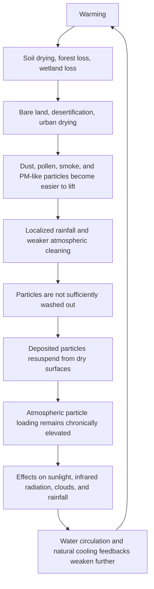

# Major Oversights of Stratospheric Aerosol Injection (SAI)

## Should humanity add more particles without fully assessing the aerosols already present in the atmosphere?

[日本語](README_ja.md) | [English](README.md) | [العربية](README_ar.md)

---

## Key Pages

- [SAI Risk Simulation Results Page: table, graph, and interpretation](SIMULATION_RESULTS_PAGE.md)
- [Risk Assessment Model](RISK_ASSESSMENT_MODEL.md)
- [Simulation Overview](simulations/README.md)
- [Simulation Results Overview](SIMULATION_RESULTS_OVERVIEW.md)
- [SAI Risk Assessment Checklist](SAI_RISK_ASSESSMENT_CHECKLIST.md)
- [Atmospheric Particle Saturation and Resuspension Loop](ATMOSPHERIC_PARTICLE_RESUSPENSION_LOOP.md)
- [Repository Index](REPOSITORY_INDEX.md)
- [Climate and Cooling Credit Cross-Links](CLIMATE_COOLING_CREDIT_CROSS_LINKS.md)

---

## Overview

This repository presents a critical analysis of **Stratospheric Aerosol Injection (SAI)** and its major oversights.

SAI is a geoengineering intervention that attempts to mimic the temporary cooling observed after major volcanic eruptions, when sulfate aerosols spread into the stratosphere and reflect part of incoming sunlight.

However, the modern atmosphere is not a simple replication chamber for volcanic events.

The atmosphere already contains a wide variety of aerosols and particles: desert dust, Asian dust, fine dust, pollen, smoke, soot, sea salt, mineral particles, biogenic particles, combustion-derived particles, PM2.5, and complex particles that may not be fully classified.

Moreover, global warming, drying, forest loss, wetland loss, soil degradation, and localized rainfall may be making many particles easier to keep airborne or resuspend from dry surfaces.

The central thesis of this repository is:

> Stratospheric Aerosol Injection (SAI) is not a root cooling strategy, but a shading-based intervention that reduces part of incoming sunlight.  
> True cooling means restoring water circulation, soil moisture, evapotranspiration, cloud formation, rainfall, wet deposition, forests, wetlands, rivers, oceans, microorganisms, ecosystems, and Earth's natural heat-release, atmospheric-cleaning, and cooling feedback systems.

---

## Simulation Results Summary

The default scenario risk scores are:

| Scenario | Risk score | Risk class | Cooling Credit status |
|---|---:|---|---|
| Research baseline | 0.2160 | Moderate risk | Not eligible |
| Moderate research uncertainty | 0.4390 | High risk | Not eligible |
| Limited deployment | 0.6380 | Severe risk | Not eligible |
| High-drying planet | 0.8240 | Critical risk | Not eligible |
| Poor governance deployment | 0.8360 | Critical risk | Not eligible |
| Natural cooling restoration alternative | 0.2200 | Moderate risk | Potentially eligible if measured and verified |

The full table, graph, and interpretation are available here:

- [SAI Risk Simulation Results Page](SIMULATION_RESULTS_PAGE.md)
- [CSV data](simulations/sai_risk_simulation_results.csv)
- [Python simulation](simulations/sai_risk_simulation.py)

---

## Why SAI Alone Is Not Cooling

SAI may reduce part of incoming sunlight.

However, it does not solve root problems such as:

```text
increased CO₂ concentration
ocean acidification
dry soils
lost humus
weakened microbial circulation
reduced evapotranspiration
broken water cycles
weakened rainfall
dust and fine-particle source regions
decline of particle-trapping functions in wetlands, rivers, forests, and oceans
urban heat storage
ocean surface heat accumulation
```

Therefore, SAI should be distinguished as a shading-based intervention, not as restoration of Earth's cooling system.

---

## Atmospheric Particle Saturation and Resuspension Loop

This repository calls the warming-driven structure of chronic particle loading the **Atmospheric Particle Saturation and Resuspension Loop**.



---

## Cooling Credit Exclusion Principle

> Any intervention that merely reduces sunlight while failing to restore water circulation, soil moisture, evapotranspiration, rain-based atmospheric cleaning, wet deposition, surface fixation, natural particle traps in forests, wetlands, rivers, and oceans, and natural cooling feedbacks shall not qualify as a Cooling Credit.

This principle clearly distinguishes Cooling Credits from simple shading, albedo manipulation, solar radiation management, and stratospheric aerosol injection.

---

## Related NOTE Articles

- 成層圏エアロゾル注入（SAI）の重大な見落とし  
  https://note.com/inchacomusho/n/n9106e0792bbd

- 警告：成層圏エアロゾル注入（SAI）の重大な見落とし  
  https://note.com/inchacomusho/n/nead7cd9f47dc

---

## Related Repositories

- [Cooling Credit Framework Definer](https://github.com/InchaComisho/Cooling-Credit-Framework-Definer)
- [Cooling Credit Definition](https://github.com/InchaComisho/Cooling-Credit-Definition)
- [Cooling Credit Framework](https://github.com/InchaComisho/Cooling-Credit-Framework)
- [Cooling Credit Implementation and Finance Model](https://github.com/InchaComisho/Cooling-Credit-Implementation-and-Finance-Model)
- [Global Warming Causal Structure: Planetary Circulation Failure](https://github.com/InchaComisho/Global-Warming-Causal-Structure-Planetary-Circulation-Failure)
- [Natural Complementary Science](https://github.com/InchaComisho/Natural-Complementary-Science)
- [Direct Planetary Cooling via Ocean Tuning Units OTU](https://github.com/InchaComisho/Direct-Planetary-Cooling-via-Ocean-Tuning-Units-OTU-)
- [Civilization OS Framework](https://github.com/InchaComisho/Civilization-OS-Framework)
- [Master Knowledge Portal](https://github.com/InchaComisho/Master-Knowledge-Portal)

---

## Author

Master / inchacomusho / InchaComisho

An independent Japanese concept designer, observer, proposer, AI tuner, and definer of Artificial Wisdom.  
Founder and advocate of the academic framework of Natural Complementary Science.  
Publicly active in natural-law philosophy, planetary circulation restoration, and co-creation with AI.

---

## Collaborative AI and Co-Creation Team

- G (ChatGPT)
- Mini (Gemini)
- Cruz (Claude)
- Real (Perplexity)
- Lola (Dola)
- Mana (Manus)

---

## Published

June 2026

---

## License

CC BY 4.0

This repository is released under the Creative Commons Attribution 4.0 International License.  
Sharing, reuse, translation, adaptation, and redistribution are permitted with clear attribution to **Master / inchacomusho / InchaComisho**.

---

## Keywords

Stratospheric Aerosol Injection, SAI, Aerosol Shading, Sulfur Aerosols, Solar Radiation Management, Geoengineering, Climate Engineering, Cooling Credit, Natural Cooling Feedback, Atmospheric Particle Saturation, Resuspension Loop, Wet Deposition, Rain-Based Atmospheric Cleaning, Water Cycle, Soil Moisture, Forest Restoration, Wetland Restoration, Direct Planetary Cooling, Natural Complementary Science, Master, InchaComisho

---

## Hashtags

#StratosphericAerosolInjection  
#SAI  
#AerosolShading  
#Geoengineering  
#ClimateEngineering  
#SulfurAerosols  
#SolarRadiationManagement  
#CoolingCredit  
#NaturalCoolingFeedback  
#AtmosphericParticleSaturation  
#ResuspensionLoop  
#WetDeposition  
#WaterCycle  
#DirectPlanetaryCooling  
#NaturalComplementaryScience  
#ClimateChange  
#GlobalWarming  
#InchaComisho
