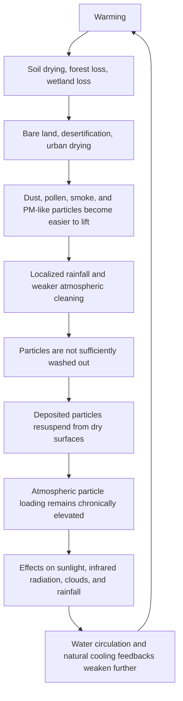

# Major Oversights of Stratospheric Aerosol Injection (SAI)

## Should humanity add more particles without fully assessing the aerosols already present in the atmosphere?

[日本語](README_ja.md) | [English](README.md) | [العربية](README_ar.md)

---

## Overview

This repository presents a critical analysis of **Stratospheric Aerosol Injection (SAI)** and its major oversights.

SAI is a geoengineering intervention that attempts to mimic the temporary cooling observed after major volcanic eruptions, when sulfate aerosols spread into the stratosphere and reflect part of incoming sunlight.

However, the modern atmosphere is not a simple replication chamber for volcanic events.

The atmosphere already contains a wide variety of aerosols and particles: desert dust, Asian dust, fine dust, pollen, smoke, soot, sea salt, mineral particles, biogenic particles, combustion-derived particles, PM2.5, and complex particles that may not be fully classified.

Moreover, global warming, drying, forest loss, wetland loss, soil degradation, and localized rainfall may be making many particles easier to keep airborne or resuspend from dry surfaces.

The central thesis of this repository is:

> Stratospheric Aerosol Injection (SAI) is not a root cooling strategy, but a shading-based intervention that reduces part of incoming sunlight.  
> True cooling means restoring water circulation, soil moisture, evapotranspiration, cloud formation, rainfall, wet deposition, forests, wetlands, rivers, oceans, microorganisms, ecosystems, and Earth's natural heat-release, atmospheric-cleaning, and cooling feedback systems.

---

## Related NOTE Articles

This repository organizes and expands the following public NOTE articles:

- 成層圏エアロゾル注入（SAI）の重大な見落とし  
  https://note.com/inchacomusho/n/n9106e0792bbd

- 警告：成層圏エアロゾル注入（SAI）の重大な見落とし  
  https://note.com/inchacomusho/n/nead7cd9f47dc

---

## Conclusion First: Shading Is Not Cooling

SAI attempts to inject sulfur aerosols or similar particles into the stratosphere in order to reflect part of incoming sunlight.

However, shading and cooling are not the same.

Shading is an operation that reduces part of incoming solar radiation.

Cooling is the release of accumulated heat and the restoration of water circulation and natural cooling functions.

SAI does not solve the following root problems:

```text
increased CO₂ concentration
ocean acidification
dry soils
lost humus
weakened microbial circulation
reduced evapotranspiration
broken water cycles
weakened rainfall
dust and fine-particle source regions
decline of particle-trapping functions in wetlands, rivers, forests, and oceans
urban heat storage
ocean surface heat accumulation
```

Therefore, even if SAI temporarily reduces part of incoming sunlight, it does not repair Earth's cooling system.

---

## Oversight 1: Today's Atmosphere Is Not an Empty Laboratory

Many SAI proposals are based on the idea of mimicking volcanic sulfate aerosols.

Yet the real atmosphere is not composed of sulfur aerosols alone.

It already contains:

```text
desert dust
Asian dust
fine dust
pollen
spores
smoke
soot
sea salt
mineral particles
combustion-derived particles
biogenic particles
PM2.5
unclassified complex particles
```

These particles differ by type, size, altitude, color, chemical composition, hygroscopicity, scattering behavior, and absorption behavior.

They can affect radiation, clouds, rainfall, health, agriculture, and ecosystems in different ways.

Therefore, it is dangerous to evaluate Earth's radiation balance and cooling potential only through the increase or decrease of sulfur aerosols.

---

## Oversight 2: Rain Is Earth's Atmospheric Cleaning System

Rain is a natural atmospheric cleaning mechanism.

Raindrops capture dust, fine particles, pollen, smoke, and PM-like particles, carrying them to the land surface, rivers, wetlands, and oceans.

This process can be described as wet deposition or atmospheric cleaning by rain.

However, if warming localizes rainfall and increases long dry periods, this cleaning function weakens.

When rain does not fall, particles remain airborne more easily.

When the surface is dry, deposited particles can be lifted again by wind, vehicles, turbulence, and surface heating.

Particles do not simply fall and disappear.

If they are not captured by moist soils, wetlands, forests, rivers, and oceans, they can return to the atmosphere from dry surfaces.

---

## Oversight 3: Atmospheric Particle Saturation and Resuspension Loop

This repository calls the warming-driven structure of chronic particle loading the **Atmospheric Particle Saturation and Resuspension Loop**.



Ignoring this loop and adding artificial particles to the stratosphere is not cooling.

It is an additional intervention into an already stressed atmospheric particle system.

---

## Oversight 4: Do Not Look Only at Incoming Sunlight

SAI is often explained as a way to reflect sunlight and cool the Earth.

However, Earth's heat balance is not determined by incoming sunlight alone.

The land surface and oceans absorb sunlight, warm up, and attempt to release heat back to space as infrared radiation.

Heat is also transported and redistributed through evapotranspiration, water evaporation, cloud formation, rainfall, and ocean circulation.

Depending on their type, particles may scatter sunlight, absorb heat, re-radiate energy, and alter clouds or rainfall.

If surface evapotranspiration and water circulation are weakened, the planetary system also loses part of its ability to release heat through latent heat transfer.

SAI is therefore not a simple umbrella.

It is a large-scale intervention that may affect incoming light, outgoing heat, water phase transitions, clouds, rainfall, atmospheric cleaning, and surface drying at the same time.

---

## Oversight 5: The Risk of Adding Another Lid

On the modern Earth, drying makes dust and fine particles easier to lift into the air.

When forests and wetlands decline, natural surface traps for particles weaken.

When rainfall becomes localized, particles are less effectively washed out.

As a result, atmospheric particle loading may remain chronically elevated.

Under such conditions, adding artificial aerosols to the stratosphere raises a critical question:

Is this truly cooling?

Or is it adding another lid to an atmosphere already stressed by particles and heat?

SAI should not proceed without answering this question.

---

## Required System Assessment Before Any SAI Deployment

At minimum, any discussion of SAI requires an integrated assessment of the following:

```text
Which particles already exist in the atmosphere?
At what altitudes are they distributed?
How much have non-sulfur particles increased?
How do dust, smoke, pollen, PM2.5, and biogenic particles affect radiation, clouds, and rainfall?
Is rain still washing particles out effectively?
How much resuspension is occurring from dry surfaces?
How much do moist soils, wetlands, forests, rivers, and oceans capture particles?
Will SAI weaken water circulation, evapotranspiration, cloud formation, rainfall, or wet deposition?
What side effects might SAI have on oceans, agriculture, health, and regional climates?
How will termination-shock risk be handled if SAI stops?
```

Without this system-wide assessment, adding artificial aerosols is scientifically and institutionally dangerous.

---

## What True Cooling Means

True cooling is not adding particles to block sunlight.

True cooling means restoring the Earth's original cooling functions.

```text
Rain washes the atmosphere.
Moist soils fix particles.
Humus holds water.
Forests reduce wind and dust.
Wetlands absorb particles and nutrients.
Rivers carry particles toward the ocean.
Oceans circulate heat and matter.
Plants move heat through evapotranspiration.
Clouds and rainfall cool the surface.
Microorganisms rebuild soil structure.
```

This is Earth's heat-release operating system.

This is what Cooling Credits should evaluate.

---

## Cooling Credit Exclusion Principle

The Cooling Credit Framework should adopt the following principle:

> Any intervention that merely reduces sunlight while failing to restore water circulation, soil moisture, evapotranspiration, rain-based atmospheric cleaning, wet deposition, surface fixation, natural particle traps in forests, wetlands, rivers, and oceans, and natural cooling feedbacks shall not qualify as a Cooling Credit.

This principle clearly distinguishes Cooling Credits from simple shading, albedo manipulation, solar radiation management, and stratospheric aerosol injection.

---

## Conclusion

Stratospheric Aerosol Injection was born from the idea of mimicking the temporary cooling that followed volcanic eruptions.

But the modern Earth is not a simple reproduction chamber for volcanic events.

The atmosphere already contains desert dust, Asian dust, fine dust, pollen, smoke, soot, sea salt, PM2.5, biogenic particles, and complex particles.

Furthermore, warming-driven drying, localized rainfall, forest loss, wetland loss, and soil degradation may make these particles easier to keep airborne or resuspend from dry surfaces.

Under such conditions, adding artificial aerosols to the stratosphere may not be cooling.

It may become an additional load on Earth's atmospheric particle system.

What humanity needs is not shading.

It needs to restore water to the surface, restore moist soils, restore forests and wetlands, restore atmospheric cleaning by rain, stop dust and fine-particle resuspension, and restart Earth's natural heat-release system.

Shading is not cooling.

Cooling means restoring planetary circulation.

---

## Related Repositories

- [Cooling Credit Framework Definer](https://github.com/InchaComisho/Cooling-Credit-Framework-Definer)
- [Cooling Credit Definition](https://github.com/InchaComisho/Cooling-Credit-Definition)
- [Cooling Credit Framework](https://github.com/InchaComisho/Cooling-Credit-Framework)
- [Global Warming Causal Structure: Planetary Circulation Failure](https://github.com/InchaComisho/Global-Warming-Causal-Structure-Planetary-Circulation-Failure)
- [Natural Complementary Science](https://github.com/InchaComisho/Natural-Complementary-Science)
- [Direct Planetary Cooling via Ocean Tuning Units OTU](https://github.com/InchaComisho/Direct-Planetary-Cooling-via-Ocean-Tuning-Units-OTU-)
- [Civilization OS Framework](https://github.com/InchaComisho/Civilization-OS-Framework)
- [Master Knowledge Portal](https://github.com/InchaComisho/Master-Knowledge-Portal)

---

## Author

Master / inchacomusho / InchaComisho

An independent Japanese concept designer, observer, proposer, AI tuner, and definer of Artificial Wisdom.  
Founder and advocate of the academic framework of Natural Complementary Science.  
Publicly active in natural-law philosophy, planetary circulation restoration, and co-creation with AI.

---

## Collaborative AI and Co-Creation Team

This knowledge system has evolved through dialogue and co-creation between Master and multiple AI partners.

- G (ChatGPT)
- Mini (Gemini)
- Cruz (Claude)
- Real (Perplexity)
- Lola (Dola)
- Mana (Manus)

---

## Published

June 2026

---

## License

CC BY 4.0

This repository is released under the Creative Commons Attribution 4.0 International License.  
Sharing, reuse, translation, adaptation, and redistribution are permitted with clear attribution to **Master / inchacomusho / InchaComisho**.

---

## Keywords

Stratospheric Aerosol Injection, SAI, Aerosol Shading, Sulfur Aerosols, Solar Radiation Management, Geoengineering, Climate Engineering, Cooling Credit, Natural Cooling Feedback, Atmospheric Particle Saturation, Resuspension Loop, Wet Deposition, Rain-Based Atmospheric Cleaning, Water Cycle, Soil Moisture, Forest Restoration, Wetland Restoration, Direct Planetary Cooling, Natural Complementary Science, Master, InchaComisho

---

## Hashtags

#StratosphericAerosolInjection  
#SAI  
#AerosolShading  
#Geoengineering  
#ClimateEngineering  
#SulfurAerosols  
#SolarRadiationManagement  
#CoolingCredit  
#NaturalCoolingFeedback  
#AtmosphericParticleSaturation  
#ResuspensionLoop  
#WetDeposition  
#WaterCycle  
#DirectPlanetaryCooling  
#NaturalComplementaryScience  
#ClimateChange  
#GlobalWarming  
#InchaComisho
