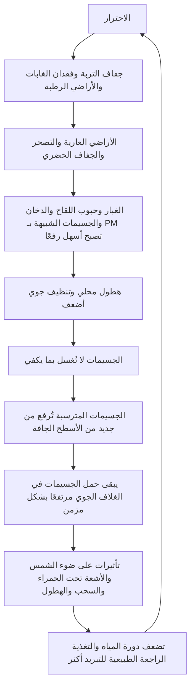

# الجوانب الخطيرة المُغفلة في حقن الهباء الجوي في الستراتوسفير (SAI)

## هل يجوز إضافة المزيد من الجسيمات من دون تقييم الهباء الجوي الموجود بالفعل في الغلاف الجوي؟

[日本語](README_ja.md) | [English](README.md) | [العربية](README_ar.md)

---

## صفحات مهمة

- [صفحة نتائج محاكاة مخاطر SAI: جدول ورسم بياني وتفسير](SIMULATION_RESULTS_PAGE_ar.md)
- [نموذج تقييم المخاطر](RISK_ASSESSMENT_MODEL_ar.md)
- [نظرة عامة على المحاكاة](simulations/README_ar.md)
- [نظرة عامة على نتائج المحاكاة](SIMULATION_RESULTS_OVERVIEW_ar.md)
- [قائمة تقييم مخاطر SAI قبل التنفيذ](SAI_RISK_ASSESSMENT_CHECKLIST.md)
- [حلقة تشبع الجسيمات الجوية وإعادة الرفع](ATMOSPHERIC_PARTICLE_RESUSPENSION_LOOP.md)
- [فهرس المستودع](REPOSITORY_INDEX.md)
- [روابط الاحترار العالمي وأرصدة التبريد](CLIMATE_COOLING_CREDIT_CROSS_LINKS.md)

---

## نظرة عامة

يعرض هذا المستودع تحليلًا نقديًا لـ **حقن الهباء الجوي في الستراتوسفير (Stratospheric Aerosol Injection / SAI)** والجوانب الخطيرة المُغفلة فيه.

SAI هو تدخل من الهندسة الجيولوجية يحاول محاكاة التبريد المؤقت الذي لوحظ بعد الثورات البركانية الكبرى، عندما تنتشر كبريتات الهباء الجوي في الستراتوسفير وتعكس جزءًا من ضوء الشمس الداخل.

لكن الغلاف الجوي الحديث ليس غرفة تجريب بسيطة لإعادة إنتاج أحداث بركانية.

الغلاف الجوي يحتوي بالفعل على مجموعة واسعة من الهباء والجسيمات: غبار الصحراء، والغبار الآسيوي، والغبار الدقيق، وحبوب اللقاح، والدخان، والسخام، وملح البحر، والجسيمات المعدنية، والجسيمات الحيوية، والجسيمات الناتجة عن الاحتراق، وPM2.5، وجسيمات مركبة قد لا تكون مصنفة بالكامل.

علاوة على ذلك، قد يؤدي الاحترار العالمي، والجفاف، وفقدان الغابات، وفقدان الأراضي الرطبة، وتدهور التربة، ومحلية الهطول إلى جعل كثير من الجسيمات أسهل بقاءً في الهواء أو أسهل إعادة رفع من الأسطح الجافة.

الأطروحة المركزية لهذا المستودع هي:

> حقن الهباء الجوي في الستراتوسفير (SAI) ليس استراتيجية تبريد جذرية، بل تدخل قائم على الحجب يقلل جزءًا من ضوء الشمس الداخل.  
> التبريد الحقيقي يعني استعادة دورة المياه، ورطوبة التربة، والتبخر-النتح، وتكوّن السحب، والهطول، والترسيب الرطب، والغابات، والأراضي الرطبة، والأنهار، والمحيطات، والكائنات الدقيقة، والنظم البيئية، وأنظمة الأرض الطبيعية لإطلاق الحرارة وتنظيف الغلاف الجوي والتغذية الراجعة للتبريد.

---

## ملخص نتائج المحاكاة

درجات مخاطر السيناريوهات الافتراضية هي:

| السيناريو | درجة الخطر | تصنيف الخطر | حالة أرصدة التبريد |
|---|---:|---|---|
| خط أساس بحثي | 0.2160 | خطر متوسط | غير مؤهل |
| عدم يقين بحثي متوسط | 0.4390 | خطر عالٍ | غير مؤهل |
| نشر محدود لـ SAI | 0.6380 | خطر شديد | غير مؤهل |
| كوكب عالي الجفاف | 0.8240 | خطر حرج | غير مؤهل |
| نشر مع حوكمة ضعيفة | 0.8360 | خطر حرج | غير مؤهل |
| بديل استعادة التبريد الطبيعي | 0.2200 | خطر متوسط | قد يكون مؤهلًا إذا تم قياسه والتحقق منه |

الجدول الكامل والرسم البياني والتفسير موجودة هنا:

- [صفحة نتائج محاكاة مخاطر SAI](SIMULATION_RESULTS_PAGE_ar.md)
- [بيانات CSV](simulations/sai_risk_simulation_results.csv)
- [سكربت المحاكاة](simulations/sai_risk_simulation.py)

---

## لماذا لا يكون SAI وحده تبريدًا؟

قد يقلل SAI جزءًا من ضوء الشمس الداخل.

لكنه لا يحل مشكلات جذرية مثل:

```text
زيادة تركيز ثاني أكسيد الكربون
تحمض المحيطات
التربة الجافة
فقدان الدبال
ضعف دورة الكائنات الدقيقة
انخفاض التبخر-النتح
دورات المياه المكسورة
ضعف الهطول
مصادر الغبار والجسيمات الدقيقة
تراجع وظائف احتجاز الجسيمات في الأراضي الرطبة والأنهار والغابات والمحيطات
تخزين الحرارة في المدن
تراكم حرارة سطح المحيط
```

لذلك يجب تمييز SAI بوصفه تدخلًا قائمًا على الحجب، لا بوصفه استعادة لنظام تبريد الأرض.

---

## حلقة تشبع الجسيمات الجوية وإعادة الرفع

يطلق هذا المستودع على البنية التي تجعل حمل الجسيمات مزمنًا بسبب الاحترار والجفاف اسم **حلقة تشبع الجسيمات الجوية وإعادة الرفع**.



---

## مبدأ استبعاد أرصدة التبريد

> أي تدخل يكتفي بتقليل ضوء الشمس من دون استعادة دورة المياه، ورطوبة التربة، والتبخر-النتح، والتنظيف الجوي بواسطة المطر، والترسيب الرطب، والتثبيت السطحي، والمصائد الطبيعية للجسيمات في الغابات والأراضي الرطبة والأنهار والمحيطات، والتغذية الراجعة الطبيعية للتبريد، لا يكون مؤهلًا ليُعد رصيد تبريد.

يميز هذا المبدأ أرصدة التبريد بوضوح عن الحجب البسيط، والتلاعب بالبياض السطحي، وإدارة الإشعاع الشمسي، وحقن الهباء الجوي في الستراتوسفير.

---

## مقالات NOTE ذات صلة

- 成層圏エアロゾル注入（SAI）の重大な見落とし  
  https://note.com/inchacomusho/n/n9106e0792bbd

- 警告：成層圏エアロゾル注入（SAI）の重大な見落とし  
  https://note.com/inchacomusho/n/nead7cd9f47dc

- なぜ一般人がSAIの重大な見落としを指摘しなければならないのか  
  https://note.com/inchacomusho/n/n5e6768df7bd6

---

## مستودعات ذات صلة

- [Cooling Credit Framework Definer](https://github.com/InchaComisho/Cooling-Credit-Framework-Definer)
- [Cooling Credit Definition](https://github.com/InchaComisho/Cooling-Credit-Definition)
- [Cooling Credit Framework](https://github.com/InchaComisho/Cooling-Credit-Framework)
- [Cooling Credit Implementation and Finance Model](https://github.com/InchaComisho/Cooling-Credit-Implementation-and-Finance-Model)
- [Global Warming Causal Structure: Planetary Circulation Failure](https://github.com/InchaComisho/Global-Warming-Causal-Structure-Planetary-Circulation-Failure)
- [Natural Complementary Science](https://github.com/InchaComisho/Natural-Complementary-Science)
- [Direct Planetary Cooling via Ocean Tuning Units OTU](https://github.com/InchaComisho/Direct-Planetary-Cooling-via-Ocean-Tuning-Units-OTU-)
- [Civilization OS Framework](https://github.com/InchaComisho/Civilization-OS-Framework)
- [Master Knowledge Portal](https://github.com/InchaComisho/Master-Knowledge-Portal)

---

## المؤلف

Master / inchacomusho / InchaComisho

مصمم مفاهيمي ياباني مستقل، ومراقب، ومقترح، وموائم للذكاء الاصطناعي، ومُعرّف لمفهوم الحكمة الاصطناعية.  
مؤسس ومناصر للإطار الأكاديمي لعلم التكامل الطبيعي.  
ينشط علنًا في فلسفة القانون الطبيعي، واستعادة الدورة الكوكبية، والتشارك الإبداعي مع الذكاء الاصطناعي.

---

## فريق التعاون مع الذكاء الاصطناعي

- G (ChatGPT)
- Mini (Gemini)
- Cruz (Claude)
- Real (Perplexity)
- Lola (Dola)
- Mana (Manus)

---

## تاريخ النشر

يونيو 2026

---

## الترخيص

CC BY 4.0

يُنشر هذا المستودع بموجب رخصة Creative Commons Attribution 4.0 International.  
يُسمح بالمشاركة، وإعادة الاستخدام، والترجمة، والتعديل، وإعادة التوزيع بشرط الإسناد الواضح إلى **Master / inchacomusho / InchaComisho**.

---

## الكلمات المفتاحية

حقن الهباء الجوي في الستراتوسفير، SAI، حجب الهباء الجوي، هباء الكبريت، إدارة الإشعاع الشمسي، الهندسة الجيولوجية، هندسة المناخ، رصيد التبريد، التغذية الراجعة الطبيعية للتبريد، تشبع الجسيمات الجوية، حلقة إعادة الرفع، الترسيب الرطب، تنظيف الغلاف الجوي بالمطر، دورة المياه، رطوبة التربة، تجديد الغابات، استعادة الأراضي الرطبة، التبريد الكوكبي المباشر، علم التكامل الطبيعي، Master، InchaComisho

---

## الوسوم

#StratosphericAerosolInjection  
#SAI  
#AerosolShading  
#Geoengineering  
#ClimateEngineering  
#SulfurAerosols  
#SolarRadiationManagement  
#CoolingCredit  
#NaturalCoolingFeedback  
#AtmosphericParticleSaturation  
#ResuspensionLoop  
#WetDeposition  
#WaterCycle  
#DirectPlanetaryCooling  
#NaturalComplementaryScience  
#ClimateChange  
#GlobalWarming  
#InchaComisho
