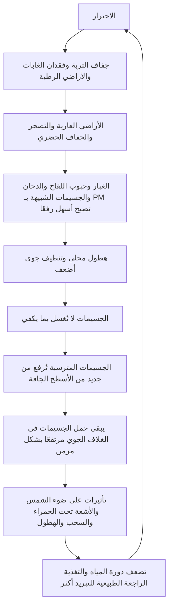

# الجوانب الخطيرة المُغفلة في حقن الهباء الجوي في الستراتوسفير (SAI)

## هل يجوز إضافة المزيد من الجسيمات من دون تقييم الهباء الجوي الموجود بالفعل في الغلاف الجوي؟

[日本語](README_ja.md) | [English](README.md) | [العربية](README_ar.md)

---

## نظرة عامة

يعرض هذا المستودع تحليلًا نقديًا لـ **حقن الهباء الجوي في الستراتوسفير (Stratospheric Aerosol Injection / SAI)** والجوانب الخطيرة المُغفلة فيه.

SAI هو تدخل من الهندسة الجيولوجية يحاول محاكاة التبريد المؤقت الذي لوحظ بعد الثورات البركانية الكبرى، عندما تنتشر كبريتات الهباء الجوي في الستراتوسفير وتعكس جزءًا من ضوء الشمس الداخل.

لكن الغلاف الجوي الحديث ليس غرفة تجريب بسيطة لإعادة إنتاج أحداث بركانية.

الغلاف الجوي يحتوي بالفعل على مجموعة واسعة من الهباء والجسيمات: غبار الصحراء، والغبار الآسيوي، والغبار الدقيق، وحبوب اللقاح، والدخان، والسخام، وملح البحر، والجسيمات المعدنية، والجسيمات الحيوية، والجسيمات الناتجة عن الاحتراق، وPM2.5، وجسيمات مركبة قد لا تكون مصنفة بالكامل.

علاوة على ذلك، قد يؤدي الاحترار العالمي، والجفاف، وفقدان الغابات، وفقدان الأراضي الرطبة، وتدهور التربة، ومحلية الهطول إلى جعل كثير من الجسيمات أسهل بقاءً في الهواء أو أسهل إعادة رفع من الأسطح الجافة.

الأطروحة المركزية لهذا المستودع هي:

> حقن الهباء الجوي في الستراتوسفير (SAI) ليس استراتيجية تبريد جذرية، بل تدخل قائم على الحجب يقلل جزءًا من ضوء الشمس الداخل.  
> التبريد الحقيقي يعني استعادة دورة المياه، ورطوبة التربة، والتبخر-النتح، وتكوّن السحب، والهطول، والترسيب الرطب، والغابات، والأراضي الرطبة، والأنهار، والمحيطات، والكائنات الدقيقة، والنظم البيئية، وأنظمة الأرض الطبيعية لإطلاق الحرارة وتنظيف الغلاف الجوي والتغذية الراجعة للتبريد.

---

## مقالات NOTE ذات صلة

ينظم هذا المستودع ويوسّع المقالات العامة التالية على NOTE:

- 成層圏エアロゾル注入（SAI）の重大な見落とし  
  https://note.com/inchacomusho/n/n9106e0792bbd

- 警告：成層圏エアロゾル注入（SAI）の重大な見落とし  
  https://note.com/inchacomusho/n/nead7cd9f47dc

---

## الخلاصة أولًا: الحجب ليس تبريدًا

يحاول SAI حقن هباء كبريتي أو جسيمات مشابهة في الستراتوسفير لعكس جزء من ضوء الشمس الداخل.

لكن الحجب والتبريد ليسا الشيء نفسه.

الحجب هو عملية تقلل جزءًا من الإشعاع الشمسي الداخل.

أما التبريد فهو إطلاق الحرارة المتراكمة واستعادة دورة المياه ووظائف التبريد الطبيعية.

SAI لا يحل المشكلات الجذرية التالية:

```text
زيادة تركيز ثاني أكسيد الكربون
تحمض المحيطات
التربة الجافة
فقدان الدبال
ضعف دورة الكائنات الدقيقة
انخفاض التبخر-النتح
دورات المياه المكسورة
ضعف الهطول
مصادر الغبار والجسيمات الدقيقة
تراجع وظائف احتجاز الجسيمات في الأراضي الرطبة والأنهار والغابات والمحيطات
تخزين الحرارة في المدن
تراكم حرارة سطح المحيط
```

لذلك، حتى إذا خفف SAI جزءًا من ضوء الشمس الداخل مؤقتًا، فإنه لا يصلح نظام التبريد الأرضي.

---

## الجانب المُغفل 1: غلاف اليوم الجوي ليس مختبرًا فارغًا

تعتمد مقترحات كثيرة لـ SAI على فكرة محاكاة هباء الكبريتات البركاني.

لكن الغلاف الجوي الحقيقي لا يتكون من هباء الكبريت وحده.

إنه يحتوي بالفعل على:

```text
غبار الصحراء
الغبار الآسيوي
الغبار الدقيق
حبوب اللقاح
الأبواغ
الدخان
السخام
ملح البحر
الجسيمات المعدنية
الجسيمات الناتجة عن الاحتراق
الجسيمات الحيوية
PM2.5
جسيمات مركبة غير مصنفة
```

تختلف هذه الجسيمات في النوع، والحجم، والارتفاع، واللون، والتركيب الكيميائي، وقابلية امتصاص الرطوبة، وسلوك التبعثر، وسلوك الامتصاص.

وقد تؤثر في الإشعاع، والسحب، والهطول، والصحة، والزراعة، والنظم البيئية بطرق مختلفة.

لذلك، من الخطير تقييم توازن إشعاع الأرض وإمكانات التبريد فقط من خلال زيادة أو نقصان هباء الكبريت.

---

## الجانب المُغفل 2: المطر هو نظام تنظيف الغلاف الجوي للأرض

المطر آلية طبيعية لتنظيف الغلاف الجوي.

تلتقط قطرات المطر الغبار والجسيمات الدقيقة وحبوب اللقاح والدخان والجسيمات الشبيهة بـ PM، وتحملها إلى سطح الأرض والأنهار والأراضي الرطبة والمحيطات.

يمكن وصف هذه العملية بالترسيب الرطب أو تنظيف الغلاف الجوي بواسطة المطر.

لكن إذا جعل الاحترار الهطول أكثر محلية وزاد فترات الجفاف الطويلة، فإن وظيفة التنظيف هذه تضعف.

عندما لا يهطل المطر، تبقى الجسيمات في الهواء بسهولة أكبر.

وعندما يكون السطح جافًا، يمكن للجسيمات المترسبة أن تُرفع مرة أخرى بواسطة الرياح والمركبات والاضطراب وتسخين السطح.

الجسيمات لا تسقط وتختفي ببساطة.

إذا لم تلتقطها التربة الرطبة، والأراضي الرطبة، والغابات، والأنهار، والمحيطات، فإنها قد تعود إلى الغلاف الجوي من الأسطح الجافة.

---

## الجانب المُغفل 3: حلقة تشبع الجسيمات الجوية وإعادة الرفع

يطلق هذا المستودع على البنية التي تجعل حمل الجسيمات مزمنًا بسبب الاحترار والجفاف اسم **حلقة تشبع الجسيمات الجوية وإعادة الرفع**.



تجاهل هذه الحلقة وإضافة جسيمات اصطناعية إلى الستراتوسفير ليس تبريدًا.

إنه تدخل إضافي في نظام جسيمات جوي مثقل أصلًا.

---

## الجانب المُغفل 4: لا تنظر إلى ضوء الشمس الداخل وحده

غالبًا ما يُشرح SAI باعتباره وسيلة لعكس ضوء الشمس وتبريد الأرض.

لكن توازن حرارة الأرض لا تحدده أشعة الشمس الداخلة وحدها.

يمتص سطح اليابسة والمحيطات ضوء الشمس، ويدفأ، ثم يحاول إطلاق الحرارة إلى الفضاء على شكل أشعة تحت حمراء.

كما تُنقل الحرارة وتُعاد توزيعها عبر التبخر-النتح، وتبخر الماء، وتكوّن السحب، والهطول، ودوران المحيطات.

بحسب نوعها، قد تبعثر الجسيمات ضوء الشمس، أو تمتص الحرارة، أو تعيد إشعاع الطاقة، أو تغيّر السحب والهطول.

وإذا ضعفت دورة المياه والتبخر-النتح السطحي، يفقد النظام الكوكبي جزءًا من قدرته على إطلاق الحرارة عبر النقل الكامن للحرارة.

لذلك، SAI ليس مظلة بسيطة.

إنه تدخل واسع النطاق قد يؤثر في الضوء الداخل، والحرارة الخارجة، وتحولات طور الماء، والسحب، والهطول، وتنظيف الغلاف الجوي، وجفاف السطح في الوقت نفسه.

---

## الجانب المُغفل 5: خطر إضافة غطاء آخر

في الأرض الحديثة، يجعل الجفاف الغبار والجسيمات الدقيقة أسهل رفعًا إلى الهواء.

عندما تتراجع الغابات والأراضي الرطبة، تضعف المصائد السطحية الطبيعية للجسيمات.

وعندما يصبح الهطول محليًا، لا تُغسل الجسيمات بفعالية كافية.

ونتيجة لذلك، قد يبقى حمل الجسيمات في الغلاف الجوي مرتفعًا بشكل مزمن.

في مثل هذه الظروف، تثير إضافة هباء اصطناعي إلى الستراتوسفير سؤالًا حاسمًا:

هل هذا تبريد حقيقي؟

أم أنه إضافة غطاء آخر إلى غلاف جوي مثقل أصلًا بالجسيمات والحرارة؟

لا ينبغي أن يتقدم SAI قبل الإجابة عن هذا السؤال.

---

## التقييم النظامي المطلوب قبل أي تنفيذ لـ SAI

يتطلب أي نقاش حول SAI، في الحد الأدنى، تقييمًا متكاملًا لما يلي:

```text
ما الجسيمات الموجودة بالفعل في الغلاف الجوي؟
في أي ارتفاعات تتوزع؟
كم زادت الجسيمات غير الكبريتية؟
كيف يؤثر الغبار والدخان وحبوب اللقاح وPM2.5 والجسيمات الحيوية في الإشعاع والسحب والهطول؟
هل لا يزال المطر يغسل الجسيمات بفعالية؟
ما مقدار إعادة الرفع من الأسطح الجافة؟
ما مقدار احتجاز التربة الرطبة والأراضي الرطبة والغابات والأنهار والمحيطات للجسيمات؟
هل سيضعف SAI دورة المياه أو التبخر-النتح أو تكوّن السحب أو الهطول أو الترسيب الرطب؟
ما الآثار الجانبية المحتملة لـ SAI على المحيطات والزراعة والصحة والمناخات الإقليمية؟
كيف سيُدار خطر التسخين السريع إذا توقف SAI؟
```

من دون هذا التقييم النظامي، تكون إضافة الهباء الاصطناعي خطيرة علميًا ومؤسسيًا.

---

## ما هو التبريد الحقيقي؟

التبريد الحقيقي ليس إضافة جسيمات لحجب ضوء الشمس.

التبريد الحقيقي يعني استعادة وظائف التبريد الأصلية للأرض.

```text
المطر يغسل الغلاف الجوي.
التربة الرطبة تثبت الجسيمات.
الدبال يحتفظ بالماء.
الغابات تقلل الرياح والغبار.
الأراضي الرطبة تمتص الجسيمات والمغذيات.
الأنهار تحمل الجسيمات نحو المحيط.
المحيطات تدوّر الحرارة والمادة.
النباتات تنقل الحرارة عبر التبخر-النتح.
السحب والهطول يبردان السطح.
الكائنات الدقيقة تعيد بناء بنية التربة.
```

هذا هو نظام إطلاق الحرارة الخاص بالأرض.

وهذا ما ينبغي أن تقيّمه أرصدة التبريد.

---

## مبدأ استبعاد أرصدة التبريد

ينبغي أن يعتمد إطار أرصدة التبريد المبدأ التالي:

> أي تدخل يكتفي بتقليل ضوء الشمس من دون استعادة دورة المياه، ورطوبة التربة، والتبخر-النتح، والتنظيف الجوي بواسطة المطر، والترسيب الرطب، والتثبيت السطحي، والمصائد الطبيعية للجسيمات في الغابات والأراضي الرطبة والأنهار والمحيطات، والتغذية الراجعة الطبيعية للتبريد، لا يكون مؤهلًا ليُعد رصيد تبريد.

يميز هذا المبدأ بوضوح أرصدة التبريد عن الحجب البسيط، والتلاعب بالبياض السطحي، وإدارة الإشعاع الشمسي، وحقن الهباء الجوي في الستراتوسفير.

---

## الخلاصة

نشأ حقن الهباء الجوي في الستراتوسفير من فكرة محاكاة التبريد المؤقت الذي أعقب الثورات البركانية.

لكن الأرض الحديثة ليست غرفة بسيطة لإعادة إنتاج الأحداث البركانية.

الغلاف الجوي يحتوي بالفعل على غبار الصحراء، والغبار الآسيوي، والغبار الدقيق، وحبوب اللقاح، والدخان، والسخام، وملح البحر، وPM2.5، والجسيمات الحيوية، والجسيمات المركبة.

علاوة على ذلك، قد يجعل الجفاف الناتج عن الاحترار، ومحلية الهطول، وفقدان الغابات، وفقدان الأراضي الرطبة، وتدهور التربة، هذه الجسيمات أسهل بقاءً في الهواء أو أسهل إعادة رفع من الأسطح الجافة.

في مثل هذه الظروف، قد لا تكون إضافة الهباء الاصطناعي إلى الستراتوسفير تبريدًا.

بل قد تصبح حملًا إضافيًا على نظام الجسيمات الجوية للأرض.

ما تحتاجه البشرية ليس الحجب.

إنها تحتاج إلى إعادة الماء إلى السطح، واستعادة التربة الرطبة، واستعادة الغابات والأراضي الرطبة، واستعادة تنظيف الغلاف الجوي بالمطر، وإيقاف إعادة رفع الغبار والجسيمات الدقيقة، وإعادة تشغيل نظام إطلاق الحرارة الطبيعي للأرض.

الحجب ليس تبريدًا.

التبريد يعني استعادة الدورة الكوكبية.

---

## مستودعات ذات صلة

- [Cooling Credit Framework Definer](https://github.com/InchaComisho/Cooling-Credit-Framework-Definer)
- [Cooling Credit Definition](https://github.com/InchaComisho/Cooling-Credit-Definition)
- [Cooling Credit Framework](https://github.com/InchaComisho/Cooling-Credit-Framework)
- [Global Warming Causal Structure: Planetary Circulation Failure](https://github.com/InchaComisho/Global-Warming-Causal-Structure-Planetary-Circulation-Failure)
- [Natural Complementary Science](https://github.com/InchaComisho/Natural-Complementary-Science)
- [Direct Planetary Cooling via Ocean Tuning Units OTU](https://github.com/InchaComisho/Direct-Planetary-Cooling-via-Ocean-Tuning-Units-OTU-)
- [Civilization OS Framework](https://github.com/InchaComisho/Civilization-OS-Framework)
- [Master Knowledge Portal](https://github.com/InchaComisho/Master-Knowledge-Portal)

---

## المؤلف

Master / inchacomusho / InchaComisho

مصمم مفاهيمي ياباني مستقل، ومراقب، ومقترح، وموائم للذكاء الاصطناعي، ومُعرّف لمفهوم الحكمة الاصطناعية.  
مؤسس ومناصر للإطار الأكاديمي لعلم التكامل الطبيعي.  
ينشط علنًا في فلسفة القانون الطبيعي، واستعادة الدورة الكوكبية، والتشارك الإبداعي مع الذكاء الاصطناعي.

---

## فريق التعاون مع الذكاء الاصطناعي

تطور هذا النظام المعرفي من خلال الحوار والتشارك الإبداعي بين Master وعدة شركاء من الذكاء الاصطناعي.

- G (ChatGPT)
- Mini (Gemini)
- Cruz (Claude)
- Real (Perplexity)
- Lola (Dola)
- Mana (Manus)

---

## تاريخ النشر

يونيو 2026

---

## الترخيص

CC BY 4.0

يُنشر هذا المستودع بموجب رخصة Creative Commons Attribution 4.0 International.  
يُسمح بالمشاركة، وإعادة الاستخدام، والترجمة، والتعديل، وإعادة التوزيع بشرط الإسناد الواضح إلى **Master / inchacomusho / InchaComisho**.

---

## الكلمات المفتاحية

حقن الهباء الجوي في الستراتوسفير، SAI، حجب الهباء الجوي، هباء الكبريت، إدارة الإشعاع الشمسي، الهندسة الجيولوجية، هندسة المناخ، رصيد التبريد، التغذية الراجعة الطبيعية للتبريد، تشبع الجسيمات الجوية، حلقة إعادة الرفع، الترسيب الرطب، تنظيف الغلاف الجوي بالمطر، دورة المياه، رطوبة التربة، تجديد الغابات، استعادة الأراضي الرطبة، التبريد الكوكبي المباشر، علم التكامل الطبيعي، Master، InchaComisho

---

## الوسوم

#StratosphericAerosolInjection  
#SAI  
#AerosolShading  
#Geoengineering  
#ClimateEngineering  
#SulfurAerosols  
#SolarRadiationManagement  
#CoolingCredit  
#NaturalCoolingFeedback  
#AtmosphericParticleSaturation  
#ResuspensionLoop  
#WetDeposition  
#WaterCycle  
#DirectPlanetaryCooling  
#NaturalComplementaryScience  
#ClimateChange  
#GlobalWarming  
#InchaComisho
