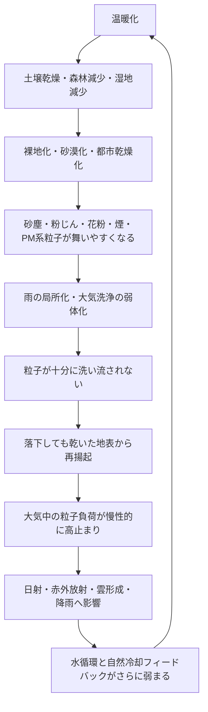

# 成層圏エアロゾル注入（SAI）の重大な見落とし

## すでに大気中に存在するエアロゾルを無視して、さらに粒子を撒いてよいのか

[日本語](README_ja.md) | [English](README.md) | [العربية](README_ar.md)

---

## 概要

本リポジトリは、成層圏エアロゾル注入（Stratospheric Aerosol Injection / SAI）に対する重大な見落としを整理するものである。

SAIは、火山噴火後に成層圏へ広がった硫酸塩エアロゾルが太陽光の一部を反射し、一時的な気温低下をもたらした事例を模倣しようとする地球工学的介入である。

しかし、現代の大気は、火山噴火後の単純な再現実験の場ではない。

すでに大気中には、砂塵、黄砂、粉じん、花粉、煙、すす、海塩、鉱物粒子、生物由来粒子、燃焼由来粒子、PM2.5、未分類の複合粒子など、多様なエアロゾルが存在している。

さらに、温暖化、乾燥、森林減少、湿地喪失、土壌劣化、雨の局所化によって、本来なら雨や湿った地表に捕捉される粒子が、大気中に残りやすくなっている可能性がある。

本リポジトリの中心命題は次の通りである。

> 成層圏エアロゾル注入（SAI）は、地球を冷やす根本対策ではなく、太陽光の一部を遮る遮光型介入である。  
> 真の冷却とは、水循環、土壌水分、蒸散、雲形成、降雨、湿潤沈着、森林、湿地、河川、海洋、微生物、生態系を回復し、地球本来の排熱・洗浄・自然冷却フィードバックを再起動することである。

---

## NOTE公開記事

本リポジトリは、以下のNOTE記事をGitHub用に整理・拡張したものである。

- 成層圏エアロゾル注入（SAI）の重大な見落とし  
  https://note.com/inchacomusho/n/n9106e0792bbd

- 警告：成層圏エアロゾル注入（SAI）の重大な見落とし  
  https://note.com/inchacomusho/n/nead7cd9f47dc

---

## 結論：遮光は冷却ではない

SAIは、成層圏へ硫黄系エアロゾルまたは類似粒子を注入し、太陽光の一部を反射させようとする。

しかし、遮光と冷却は同じではない。

遮光は、入射する太陽光の一部を減らす操作である。

冷却は、地球に蓄積した熱を逃がし、水循環と自然冷却機能を回復することである。

SAIは、次の根本問題を解決しない。

```text
CO₂濃度の増加
海洋酸性化
乾燥した土壌
失われた腐葉土
弱体化した微生物循環
減少した蒸散
壊れた水循環
弱まった降雨
砂塵・粉じんの発生源
湿地・河川・森林・海洋の粒子捕捉機能低下
都市の蓄熱
海洋表層の熱蓄積
```

したがって、SAIは一時的に日射を弱める可能性があっても、地球の冷却OSを修復するものではない。

---

## 重大な見落とし1：現代の大気は空っぽの実験室ではない

SAIの多くは、火山噴火後の硫酸塩エアロゾルによる一時的冷却を模倣する発想に基づいている。

しかし、現代の大気は硫黄エアロゾルだけで構成されていない。

現実の大気には、次のような多様な粒子が存在する。

```text
砂塵
黄砂
粉じん
花粉
胞子
煙
すす
海塩
鉱物粒子
燃焼由来粒子
生物由来粒子
PM2.5
未分類の複合粒子
```

これらの粒子は、種類、大きさ、高度、色、化学組成、吸湿性、散乱性、吸収性によって、放射、雲、降雨、健康、農業、生態系へ異なる影響を与える。

そのため、硫黄エアロゾルの増減だけを見て、地球の放射収支や冷却効果を判断することは危険である。

---

## 重大な見落とし2：雨は大気の洗浄システムである

雨は、大気中の粒子を洗い流す自然の洗浄機能である。

雨粒は、砂塵、粉じん、花粉、煙、PM系粒子を捕捉し、地表、河川、湿地、海洋へ運ぶ。

この働きは、湿潤沈着、または雨による大気洗浄と呼べる。

しかし、温暖化によって雨が局所化し、長期間雨が降らない地域が増えれば、この大気洗浄機能は弱まる。

雨が降らなければ、粒子は大気中に残りやすい。

さらに、地表が乾燥していれば、一度落ちた粒子も、風、車両、乱流、地表加熱によって再び舞い上がる。

つまり、粒子は「降って終わり」ではない。

湿った土壌、湿地、森林、河川、海洋に捕捉されなければ、乾いた地表から再び大気へ戻る。

---

## 重大な見落とし3：大気粒子飽和・再揚起ループ

本リポジトリでは、温暖化と乾燥によって粒子が大気中に残りやすくなる構造を、**大気粒子飽和・再揚起ループ**と呼ぶ。



このループを無視して、さらに成層圏へ人工粒子を追加することは、冷却ではなく、大気粒子システムへの追加介入である。

---

## 重大な見落とし4：上からの日射だけを見てはいけない

SAIの説明では、「太陽光を反射して地球を冷やす」と語られることが多い。

しかし、地球の熱収支は、上から入る日射だけで決まるわけではない。

地表と海洋は、太陽光を受けて温まり、その熱を赤外線として宇宙へ放出しようとする。

また、植物の蒸散、水の蒸発、雲形成、降雨、海洋循環によって、熱は移動し、分散される。

粒子の種類によっては、太陽光を散乱して日射を減らす一方で、熱を吸収したり、再放射したり、雲や降雨の性質を変えたりする可能性がある。

さらに、地表の蒸散や水循環を弱めれば、熱を潜熱として逃がす仕組みも弱くなる。

したがって、SAIは単純な日傘ではない。

それは、入る光、出る熱、水の相転移、雲、雨、大気洗浄、地表乾燥へ同時に影響しうる大規模介入である。

---

## 重大な見落とし5：さらに蓋をする危険

現代の地球では、乾燥によって砂塵や粉じんが舞いやすくなっている。

森林や湿地が減れば、粒子を捕捉する地表の自然トラップも弱まる。

雨が局所化すれば、粒子は洗い流されにくくなる。

その結果、大気中の粒子負荷は慢性的に高止まりしやすくなる。

この状態で、さらに成層圏へ人工エアロゾルを追加することは、本当に冷却なのか。

あるいは、すでに粒子と熱で負荷の高い大気に、さらに蓋をすることなのか。

この問いに答えないまま、SAIを進めるべきではない。

---

## SAIを実施する前に必要な総点検

SAIを議論するなら、少なくとも次の総合評価が必要である。

```text
現在の大気中にはどの粒子が存在するのか。
それらはどの高度に分布しているのか。
硫黄以外の粒子はどれだけ増えているのか。
砂塵、粉じん、煙、花粉、PM2.5、生物由来粒子は、放射・雲・雨へどう影響しているのか。
雨は粒子を洗い流せているのか。
乾いた地表から粒子はどれだけ再揚起しているのか。
湿った土壌、湿地、森林、河川、海洋は粒子をどれだけ捕捉しているのか。
SAIは水循環、蒸散、雲形成、降雨、湿潤沈着を弱めないのか。
SAIは海洋・農業・健康・地域気候にどのような副作用を持つのか。
SAI停止時の急激な再加熱リスクをどう扱うのか。
```

この総点検なしに、人工エアロゾルを追加することは、科学的にも制度的にも危険である。

---

## 真の冷却とは何か

真の冷却とは、粒子を足して光を遮ることではない。

真の冷却とは、地球が本来持っていた冷却機能を回復することである。

```text
雨が大気を洗う。
湿った土壌が粒子を固定する。
腐葉土が水を抱える。
森林が風を弱める。
湿地が粒子と栄養塩を吸着する。
河川が粒子を海へ運ぶ。
海洋が熱と物質を循環させる。
植物が蒸散で熱を移動させる。
雲と雨が地表を冷やす。
微生物が土壌構造を戻す。
```

これが、地球の排熱OSである。

これが、クーリングクレジットが評価すべき対象である。

---

## クーリングクレジット排他原則

クーリングクレジット・フレームワークでは、次の原則を採用すべきである。

> 太陽光を遮るだけで、水循環、土壌水分、蒸散、雨による大気洗浄、湿潤沈着、地表固定、森林・湿地・河川・海洋の自然トラップ、自然冷却フィードバックを回復しない介入は、クーリングクレジットの対象としない。

この原則により、クーリングクレジットは、単なる遮光、反射率操作、太陽放射管理、成層圏エアロゾル注入と明確に区別される。

---

## 結論

成層圏エアロゾル注入は、火山噴火後の一時的冷却を模倣する発想から生まれた。

しかし、現代の地球は、火山噴火直後の単純な再現実験の場ではない。

すでに大気中には、砂塵、黄砂、粉じん、花粉、煙、すす、海塩、PM2.5、生物由来粒子、複合粒子が存在している。

さらに、温暖化による乾燥、雨の局所化、森林減少、湿地喪失、土壌劣化によって、これらの粒子は大気中に残りやすくなっている可能性がある。

この状態で、さらに成層圏へ人工エアロゾルを撒くことは、冷却ではなく、地球の大気粒子システムへの追加負荷になりかねない。

本当に必要なのは、遮光ではない。

必要なのは、地表に水を戻し、土を湿らせ、森林と湿地を戻し、雨による大気洗浄を戻し、砂塵と粉じんの再揚起を止め、地球本来の排熱OSを再起動することである。

遮光は冷却ではない。

冷却とは、地球の循環を戻すことである。

---

## 関連リポジトリ

- [Cooling Credit Framework Definer](https://github.com/InchaComisho/Cooling-Credit-Framework-Definer)
- [Cooling Credit Definition](https://github.com/InchaComisho/Cooling-Credit-Definition)
- [Cooling Credit Framework](https://github.com/InchaComisho/Cooling-Credit-Framework)
- [Global Warming Causal Structure: Planetary Circulation Failure](https://github.com/InchaComisho/Global-Warming-Causal-Structure-Planetary-Circulation-Failure)
- [Natural Complementary Science](https://github.com/InchaComisho/Natural-Complementary-Science)
- [Direct Planetary Cooling via Ocean Tuning Units OTU](https://github.com/InchaComisho/Direct-Planetary-Cooling-via-Ocean-Tuning-Units-OTU-)
- [Civilization OS Framework](https://github.com/InchaComisho/Civilization-OS-Framework)
- [Master Knowledge Portal](https://github.com/InchaComisho/Master-Knowledge-Portal)

---

## 著者

マスター / inchacomusho / InchaComisho

日本の独立構想者、観測者、提案者、AI調律者、人工叡智の定義者。  
自然補完科学の学問体系の構築・提唱者。  
自然法則思想、地球循環再生、AIとの共創を中心に公開活動を行う。

---

## 協力AIと共創チーム

この知識体系は、マスターと複数のAIパートナーとの対話と共創によって発展してきた。

- G（ChatGPT）
- ミニ（Gemini）
- クルス（Claude）
- リアル（Perplexity）
- ローラ（Lola/Dola）
- マナ（Manus）

---

## 公開月

2026年6月

---

## ライセンス

CC BY 4.0

本リポジトリの内容は、Creative Commons Attribution 4.0 International License（CC BY 4.0）で公開する。  
著者表示を行う限り、共有、転載、翻訳、改変、再利用を許可する。

---

## キーワード

成層圏エアロゾル注入, SAI, Stratospheric Aerosol Injection, エアロゾル遮光, 硫黄エアロゾル, 太陽放射管理, 地球工学, ジオエンジニアリング, クーリングクレジット, Cooling Credit, 自然冷却フィードバック, 大気粒子飽和, 再揚起ループ, 湿潤沈着, 雨による大気洗浄, 水循環, 土壌水分, 森林再生, 湿地再生, 地球直接冷却, 自然補完科学, マスター, InchaComisho

---

## ハッシュタグ

#成層圏エアロゾル注入  
#SAI  
#StratosphericAerosolInjection  
#エアロゾル遮光  
#地球工学  
#ジオエンジニアリング  
#硫黄エアロゾル  
#太陽放射管理  
#クーリングクレジット  
#CoolingCredit  
#自然冷却フィードバック  
#大気粒子飽和  
#再揚起ループ  
#湿潤沈着  
#水循環  
#地球直接冷却  
#自然補完科学  
#気候変動  
#温暖化対策  
#InchaComisho
