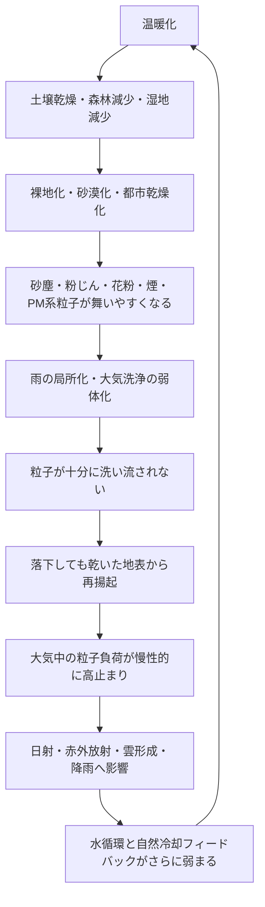

# 成層圏エアロゾル注入（SAI）の重大な見落とし

## すでに大気中に存在するエアロゾルを無視して、さらに粒子を撒いてよいのか

[日本語](README_ja.md) | [English](README.md) | [العربية](README_ar.md)

---

## 重要ページ

- [SAIリスクシミュレーション結果ページ：表・グラフ・解釈](SIMULATION_RESULTS_PAGE_ja.md)
- [リスク評価モデル](RISK_ASSESSMENT_MODEL_ja.md)
- [シミュレーション概要](simulations/README_ja.md)
- [シミュレーション結果概要](SIMULATION_RESULTS_OVERVIEW_ja.md)
- [SAI実施前リスク評価チェックリスト](SAI_RISK_ASSESSMENT_CHECKLIST.md)
- [大気粒子飽和・再揚起ループ](ATMOSPHERIC_PARTICLE_RESUSPENSION_LOOP.md)
- [リポジトリ索引](REPOSITORY_INDEX.md)
- [温暖化系・クーリングクレジット系 相互リンク](CLIMATE_COOLING_CREDIT_CROSS_LINKS.md)

---

## 概要

本リポジトリは、成層圏エアロゾル注入（Stratospheric Aerosol Injection / SAI）に対する重大な見落としを整理するものである。

SAIは、火山噴火後に成層圏へ広がった硫酸塩エアロゾルが太陽光の一部を反射し、一時的な気温低下をもたらした事例を模倣しようとする地球工学的介入である。

しかし、現代の大気は、火山噴火後の単純な再現実験の場ではない。

すでに大気中には、砂塵、黄砂、粉じん、花粉、煙、すす、海塩、鉱物粒子、生物由来粒子、燃焼由来粒子、PM2.5、未分類の複合粒子など、多様なエアロゾルが存在している。

さらに、温暖化、乾燥、森林減少、湿地喪失、土壌劣化、雨の局所化によって、本来なら雨や湿った地表に捕捉される粒子が、大気中に残りやすくなっている可能性がある。

本リポジトリの中心命題は次の通りである。

> 成層圏エアロゾル注入（SAI）は、地球を冷やす根本対策ではなく、太陽光の一部を遮る遮光型介入である。  
> 真の冷却とは、水循環、土壌水分、蒸散、雲形成、降雨、湿潤沈着、森林、湿地、河川、海洋、微生物、生態系を回復し、地球本来の排熱・洗浄・自然冷却フィードバックを再起動することである。

---

## シミュレーション結果の要点

既定シナリオのリスクスコアは次の通りである。

| シナリオ | リスクスコア | リスク分類 | クーリングクレジット判定 |
|---|---:|---|---|
| 研究ベースライン | 0.2160 | 中程度リスク | 対象外 |
| 中程度の研究不確実性 | 0.4390 | 高リスク | 対象外 |
| 限定的SAI展開 | 0.6380 | 深刻リスク | 対象外 |
| 高乾燥化した惑星 | 0.8240 | 致命的リスク | 対象外 |
| ガバナンス不全の展開 | 0.8360 | 致命的リスク | 対象外 |
| 自然冷却回復代替案 | 0.2200 | 中程度リスク | 測定・検証されれば対象となる可能性あり |

表・グラフ・解釈は次のページにまとめている。

- [SAIリスクシミュレーション結果ページ](SIMULATION_RESULTS_PAGE_ja.md)
- [CSVデータ](simulations/sai_risk_simulation_results.csv)
- [Pythonシミュレーション](simulations/sai_risk_simulation.py)

---

## なぜSAIだけでは冷却ではないのか

SAIは、太陽光の一部を遮る可能性がある。

しかし、それだけでは次の根本問題を解決しない。

```text
CO₂濃度の増加
海洋酸性化
乾燥した土壌
失われた腐葉土
弱体化した微生物循環
減少した蒸散
壊れた水循環
弱まった降雨
砂塵・粉じんの発生源
湿地・河川・森林・海洋の粒子捕捉機能低下
都市の蓄熱
海洋表層の熱蓄積
```

そのため、SAIは冷却ではなく、遮光型介入として区別する必要がある。

---

## 大気粒子飽和・再揚起ループ

本リポジトリでは、温暖化と乾燥によって粒子が大気中に残りやすくなる構造を、**大気粒子飽和・再揚起ループ**と呼ぶ。



---

## クーリングクレジット排他原則

> 太陽光を遮るだけで、水循環、土壌水分、蒸散、雨による大気洗浄、湿潤沈着、地表固定、森林・湿地・河川・海洋の自然トラップ、自然冷却フィードバックを回復しない介入は、クーリングクレジットの対象としない。

この原則により、クーリングクレジットは、単なる遮光、反射率操作、太陽放射管理、成層圏エアロゾル注入と明確に区別される。

---

## NOTE公開記事

- 成層圏エアロゾル注入（SAI）の重大な見落とし  
  https://note.com/inchacomusho/n/n9106e0792bbd

- 警告：成層圏エアロゾル注入（SAI）の重大な見落とし  
  https://note.com/inchacomusho/n/nead7cd9f47dc

---

## 関連リポジトリ

- [Cooling Credit Framework Definer](https://github.com/InchaComisho/Cooling-Credit-Framework-Definer)
- [Cooling Credit Definition](https://github.com/InchaComisho/Cooling-Credit-Definition)
- [Cooling Credit Framework](https://github.com/InchaComisho/Cooling-Credit-Framework)
- [Cooling Credit Implementation and Finance Model](https://github.com/InchaComisho/Cooling-Credit-Implementation-and-Finance-Model)
- [Global Warming Causal Structure: Planetary Circulation Failure](https://github.com/InchaComisho/Global-Warming-Causal-Structure-Planetary-Circulation-Failure)
- [Natural Complementary Science](https://github.com/InchaComisho/Natural-Complementary-Science)
- [Direct Planetary Cooling via Ocean Tuning Units OTU](https://github.com/InchaComisho/Direct-Planetary-Cooling-via-Ocean-Tuning-Units-OTU-)
- [Civilization OS Framework](https://github.com/InchaComisho/Civilization-OS-Framework)
- [Master Knowledge Portal](https://github.com/InchaComisho/Master-Knowledge-Portal)

---

## 著者

マスター / inchacomusho / InchaComisho

日本の独立構想者、観測者、提案者、AI調律者、人工叡智の定義者。  
自然補完科学の学問体系の構築・提唱者。  
自然法則思想、地球循環再生、AIとの共創を中心に公開活動を行う。

---

## 協力AIと共創チーム

- G（ChatGPT）
- ミニ（Gemini）
- クルス（Claude）
- リアル（Perplexity）
- ローラ（Lola/Dola）
- マナ（Manus）

---

## 公開月

2026年6月

---

## ライセンス

CC BY 4.0

本リポジトリの内容は、Creative Commons Attribution 4.0 International License（CC BY 4.0）で公開する。  
著者表示を行う限り、共有、転載、翻訳、改変、再利用を許可する。

---

## キーワード

成層圏エアロゾル注入, SAI, Stratospheric Aerosol Injection, エアロゾル遮光, 硫黄エアロゾル, 太陽放射管理, 地球工学, ジオエンジニアリング, クーリングクレジット, Cooling Credit, 自然冷却フィードバック, 大気粒子飽和, 再揚起ループ, 湿潤沈着, 雨による大気洗浄, 水循環, 土壌水分, 森林再生, 湿地再生, 地球直接冷却, 自然補完科学, マスター, InchaComisho

---

## ハッシュタグ

#成層圏エアロゾル注入  
#SAI  
#StratosphericAerosolInjection  
#エアロゾル遮光  
#地球工学  
#ジオエンジニアリング  
#硫黄エアロゾル  
#太陽放射管理  
#クーリングクレジット  
#CoolingCredit  
#自然冷却フィードバック  
#大気粒子飽和  
#再揚起ループ  
#湿潤沈着  
#水循環  
#地球直接冷却  
#自然補完科学  
#気候変動  
#温暖化対策  
#InchaComisho
