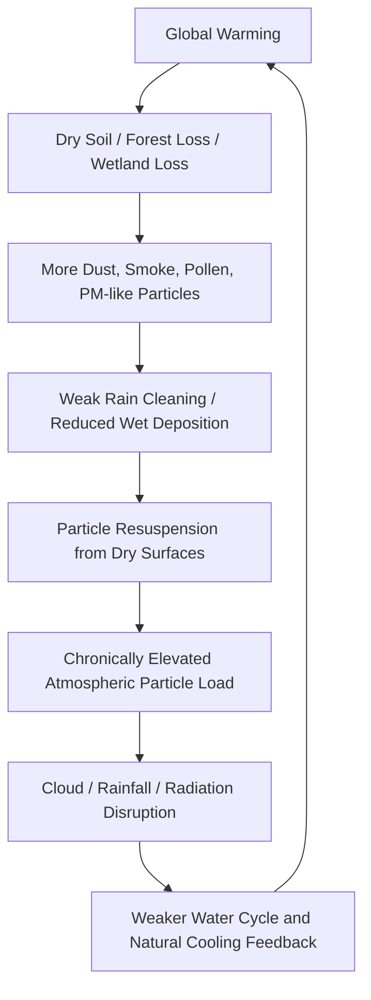

# Repository Index

## Major Oversights of Stratospheric Aerosol Injection (SAI)

This repository documents the critical oversight that **stratospheric aerosol injection is a shading-based intervention, not a restoration of Earth's natural cooling system**.

It connects atmospheric particles, wet deposition, rainfall, soil moisture, resuspension, planetary circulation failure, risk scoring, simulation, and the Cooling Credit exclusion principle.

---

## Language Top Pages

- [README_ja.md](README_ja.md)  
  日本語版トップ：成層圏エアロゾル注入（SAI）の重大な見落とし

- [README.md](README.md)  
  English top: Major Oversights of Stratospheric Aerosol Injection (SAI)

- [README_ar.md](README_ar.md)  
  العربية: الصفحة الرئيسية للجوانب الخطيرة المُغفلة في SAI

---

## Simulation Results Pages

These pages contain the simulation table, Mermaid graph, risk-class thresholds, interpretation, and data links.

- [SAIリスクシミュレーション結果ページ](SIMULATION_RESULTS_PAGE_ja.md)
- [SAI Risk Simulation Results Page](SIMULATION_RESULTS_PAGE.md)
- [صفحة نتائج محاكاة مخاطر SAI](SIMULATION_RESULTS_PAGE_ar.md)

---

## Risk Assessment Model

- [RISK_ASSESSMENT_MODEL_ja.md](RISK_ASSESSMENT_MODEL_ja.md)  
  日本語版：SAIリスク評価モデル

- [RISK_ASSESSMENT_MODEL.md](RISK_ASSESSMENT_MODEL.md)  
  English: SAI Risk Assessment Model

- [RISK_ASSESSMENT_MODEL_ar.md](RISK_ASSESSMENT_MODEL_ar.md)  
  العربية: نموذج تقييم مخاطر SAI

---

## Simulation Overview

- [simulations/README_ja.md](simulations/README_ja.md)
- [simulations/README.md](simulations/README.md)
- [simulations/README_ar.md](simulations/README_ar.md)
- [simulations/sai_risk_simulation.py](simulations/sai_risk_simulation.py)
- [simulations/sai_risk_simulation_results.csv](simulations/sai_risk_simulation_results.csv)

---

## Simulation Results Overview

- [SIMULATION_RESULTS_OVERVIEW_ja.md](SIMULATION_RESULTS_OVERVIEW_ja.md)
- [SIMULATION_RESULTS_OVERVIEW.md](SIMULATION_RESULTS_OVERVIEW.md)
- [SIMULATION_RESULTS_OVERVIEW_ar.md](SIMULATION_RESULTS_OVERVIEW_ar.md)

---

## Technical Strengthening Documents

- [SAI_RISK_ASSESSMENT_CHECKLIST.md](SAI_RISK_ASSESSMENT_CHECKLIST.md)  
  A system-level risk assessment checklist that should be completed before any SAI deployment or policy support.

- [ATMOSPHERIC_PARTICLE_RESUSPENSION_LOOP.md](ATMOSPHERIC_PARTICLE_RESUSPENSION_LOOP.md)  
  A technical explanation of the atmospheric particle saturation and resuspension loop.

- [CLIMATE_COOLING_CREDIT_CROSS_LINKS.md](CLIMATE_COOLING_CREDIT_CROSS_LINKS.md)  
  Cross-links connecting global warming causal-structure repositories, SAI risk analysis, and Cooling Credit repositories.

---

## Key Concepts

### 1. Shading Is Not Cooling

SAI may reduce part of incoming sunlight, but this does not mean that Earth's accumulated heat, water-cycle failure, soil drying, forest loss, wetland loss, or atmospheric cleaning failure has been repaired.

### 2. Today's Atmosphere Is Not an Empty Laboratory

The atmosphere already contains dust, desert sand, smoke, soot, sea salt, pollen, PM2.5, biogenic particles, combustion-derived particles, and complex mixed aerosols.

### 3. Rain Is Atmospheric Cleaning

Rain removes particles through wet deposition. When rainfall becomes localized or weakened, atmospheric cleaning becomes less effective.

### 4. Dry Surfaces Resuspend Particles

Particles that settle onto dry soils, roads, bare land, and degraded surfaces can be lifted again by wind, vehicles, turbulence, and surface heating.

### 5. Cooling Means Restoring Planetary Circulation

True cooling means restoring rain, soil moisture, evapotranspiration, forests, wetlands, rivers, oceans, microorganisms, and natural heat-release systems.

---

## Visual Structure

---

## Relation to Cooling Credit

The Cooling Credit framework evaluates actions that actually restore cooling functions.

SAI and simple aerosol shading should not qualify as Cooling Credits unless they restore water circulation, soil moisture, evapotranspiration, wet deposition, surface fixation, natural particle traps, and natural cooling feedbacks.

The exclusion principle is:

> Any intervention that merely reduces sunlight while failing to restore water circulation, soil moisture, evapotranspiration, rain-based atmospheric cleaning, wet deposition, surface fixation, natural particle traps, and natural cooling feedbacks shall not qualify as a Cooling Credit.

---

## Related Repositories

- [Global Warming Causal Structure: Planetary Circulation Failure](https://github.com/InchaComisho/Global-Warming-Causal-Structure-Planetary-Circulation-Failure)
- [Cooling Credit Framework Definer](https://github.com/InchaComisho/Cooling-Credit-Framework-Definer)
- [Cooling Credit Definition](https://github.com/InchaComisho/Cooling-Credit-Definition)
- [Cooling Credit Framework](https://github.com/InchaComisho/Cooling-Credit-Framework)
- [Cooling Credit Implementation and Finance Model](https://github.com/InchaComisho/Cooling-Credit-Implementation-and-Finance-Model)
- [Direct Planetary Cooling via Ocean Tuning Units OTU](https://github.com/InchaComisho/Direct-Planetary-Cooling-via-Ocean-Tuning-Units-OTU-)
- [Natural Complementary Science](https://github.com/InchaComisho/Natural-Complementary-Science)
- [Master Knowledge Portal](https://github.com/InchaComisho/Master-Knowledge-Portal)

---

## Author

Master / inchacomusho / InchaComisho

An independent Japanese concept designer, observer, proposer, AI tuner, and definer of Artificial Wisdom.  
Founder and proposer of the academic framework of Natural Complementary Science.  
Definer of the Cooling Credit Framework, and founder and original author of the Natural Cooling Value Evaluation Protocol.  
Definer and systematizer of the causal structure of global warming and its complete solution.

Master presents global warming not merely as a problem of CO₂ concentration, but as an integrated failure involving forest loss, soil degradation, disruption of water circulation, weakening of water phase-transition processes, weakening of atmospheric circulation, ocean circulation, food circulation and organic matter circulation, weakening of evapotranspiration, cloud formation and rainfall circulation, and the shutdown of natural cooling feedbacks.  
The proposed solution connects emission reduction, recovery of carbon fixation sources, physical cooling, reactivation of natural cooling functions, MRV, Cooling Credit, and Civilization OS into an open public framework.

Master publicly develops and shares work through NOTE, GitHub, and other public media, centered on natural-law philosophy, planetary circulation restoration, and co-creation with AI.

## License

CC BY 4.0