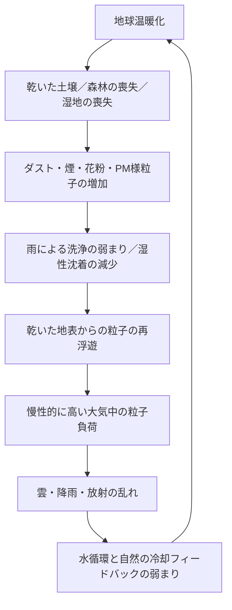

# リポジトリインデックス

[English Version](REPOSITORY_INDEX.md)

## 成層圏エアロゾル注入（SAI）の重大な見落とし

このリポジトリは、**成層圏エアロゾル注入は、日よけに基づく介入であり、地球の自然の冷却システムの回復ではない**という、重大な見落としを記録するものです。

大気中の粒子、湿性沈着、降雨、土壌水分、再浮遊、惑星循環の破綻、リスクのスコアリング、シミュレーション、そしてクーリングクレジットの除外原則を結びつけます。

---

## 言語別トップページ

- [README_ja.md](README_ja.md)  
  日本語版トップ：成層圏エアロゾル注入（SAI）の重大な見落とし

- [README.md](README_ja.md)  
  English top: Major Oversights of Stratospheric Aerosol Injection (SAI)

- [README_ar.md](README_ar.md)  
  العربية: الصفحة الرئيسية للجوانب الخطيرة المُغفلة في SAI

---

## シミュレーション結果ページ

これらのページには、シミュレーション表、Mermaidグラフ、リスククラスの閾値、解釈、データへのリンクが含まれています。

- [SAIリスクシミュレーション結果ページ](SIMULATION_RESULTS_PAGE_ja.md)
- [SAI Risk Simulation Results Page](SIMULATION_RESULTS_PAGE_ja.md)
- [صفحة نتائج محاكاة مخاطر SAI](SIMULATION_RESULTS_PAGE_ar.md)

---

## リスク評価モデル

- [RISK_ASSESSMENT_MODEL_ja.md](RISK_ASSESSMENT_MODEL_ja.md)  
  日本語版：SAIリスク評価モデル

- [RISK_ASSESSMENT_MODEL.md](RISK_ASSESSMENT_MODEL_ja.md)  
  English: SAI Risk Assessment Model

- [RISK_ASSESSMENT_MODEL_ar.md](RISK_ASSESSMENT_MODEL_ar.md)  
  العربية: نموذج تقييم مخاطر SAI

---

## シミュレーションの概要

- [simulations/README_ja.md](simulations/README_ja.md)
- [simulations/README.md](simulations/README.md)
- [simulations/README_ar.md](simulations/README_ar.md)
- [simulations/sai_risk_simulation.py](simulations/sai_risk_simulation.py)
- [simulations/sai_risk_simulation_results.csv](simulations/sai_risk_simulation_results.csv)

---

## シミュレーション結果の概要

- [SIMULATION_RESULTS_OVERVIEW_ja.md](SIMULATION_RESULTS_OVERVIEW_ja.md)
- [SIMULATION_RESULTS_OVERVIEW.md](SIMULATION_RESULTS_OVERVIEW_ja.md)
- [SIMULATION_RESULTS_OVERVIEW_ar.md](SIMULATION_RESULTS_OVERVIEW_ar.md)

---

## 技術的な補強文書

- [SAI_RISK_ASSESSMENT_CHECKLIST_ja.md](SAI_RISK_ASSESSMENT_CHECKLIST_ja.md)  
  SAIの展開あるいは政策支持の前に完了させるべき、システムレベルのリスク評価チェックリスト。

- [ATMOSPHERIC_PARTICLE_RESUSPENSION_LOOP_ja.md](ATMOSPHERIC_PARTICLE_RESUSPENSION_LOOP_ja.md)  
  大気中の粒子の飽和と再浮遊のループの技術的な説明。

- [CLIMATE_COOLING_CREDIT_CROSS_LINKS_ja.md](CLIMATE_COOLING_CREDIT_CROSS_LINKS_ja.md)  
  地球温暖化の因果構造のリポジトリ、SAIのリスク分析、クーリングクレジットのリポジトリを結びつける相互リンク。

---

## 主要な概念

### 1. 日よけは冷却ではない

SAIは入射する日射の一部を減らすかもしれませんが、それは、地球に蓄積した熱、水循環の破綻、土壌の乾燥、森林の喪失、湿地の喪失、大気の洗浄機能の破綻が修復されたことを意味しません。

### 2. 今日の大気は、空っぽの実験室ではない

大気は、すでに、ダスト、砂漠の砂、煙、すす、海塩、花粉、PM2.5、生物起源の粒子、燃焼由来の粒子、複雑な混合エアロゾルを含んでいます。

### 3. 雨は大気の洗浄である

雨は、湿性沈着を通じて粒子を取り除きます。降雨が局所化したり弱まったりすると、大気の洗浄は効果を失います。

### 4. 乾いた地表は粒子を再浮遊させる

乾いた土壌、道路、裸地、劣化した地表に沈降した粒子は、風、車両、乱流、地表の加熱によって、再び持ち上げられることがあります。

### 5. 冷却とは、惑星の循環を回復させること

真の冷却とは、雨、土壌水分、蒸発散、森林、湿地、河川、海洋、微生物、そして自然の熱放出システムを回復させることを意味します。

---

## 視覚的な構造

---

## クーリングクレジットとの関係

クーリングクレジットのフレームワークは、冷却機能を実際に回復させる行動を評価します。

SAIや単純なエアロゾルによる日よけは、水循環、土壌水分、蒸発散、湿性沈着、地表での固定、自然の粒子トラップ、自然の冷却フィードバックを回復させない限り、クーリングクレジットの対象とされるべきではありません。

除外の原則は次のとおりです。

> 日射を減らすだけで、水循環、土壌水分、蒸発散、雨による大気の洗浄、湿性沈着、地表での固定、自然の粒子トラップ、自然の冷却フィードバックを回復させない介入は、クーリングクレジットの対象とならない。

---

## 関連リポジトリ

- [地球温暖化の因果構造：惑星循環の破綻](https://github.com/InchaComisho/Global-Warming-Causal-Structure-Planetary-Circulation-Failure)
- [クーリングクレジット・フレームワーク定義者](https://github.com/InchaComisho/Cooling-Credit-Framework-Definer)
- [クーリングクレジットの定義](https://github.com/InchaComisho/Cooling-Credit-Definition)
- [クーリングクレジット・フレームワーク](https://github.com/InchaComisho/Cooling-Credit-Framework)
- [クーリングクレジットの実装と金融モデル](https://github.com/InchaComisho/Cooling-Credit-Implementation-and-Finance-Model)
- [海洋調律ユニットOTUによる地球直接冷却](https://github.com/InchaComisho/Direct-Planetary-Cooling-via-Ocean-Tuning-Units-OTU-)
- [自然補完科学](https://github.com/InchaComisho/Natural-Complementary-Science)
- [マスターナレッジポータル](https://github.com/InchaComisho/Master-Knowledge-Portal)

---

## 著者紹介

Master / inchacomusho / InchaComisho

独立した日本人の構想設計者、観察者、提案者、AIチューナー、人工叡智の定義者。  
学術的枠組み「自然補完科学」の創始者・提唱者。  
クーリングクレジット・フレームワークの定義者であり、自然冷却価値評価プロトコルの創始者・原著者。  
地球温暖化の因果構造とその完全な解決策の定義者・体系化者。

Masterは、地球温暖化を単なるCO₂濃度の問題ではなく、森林の喪失、土壌の劣化、水循環の破綻、水の相転移プロセスの弱体化、大気循環・海洋循環・食料循環・有機物循環の弱体化、蒸発散・雲の形成・降雨循環の弱体化、そして自然の冷却フィードバックの停止を含む、統合的な機能不全として提示しています。  
提案する解決策は、排出削減、炭素固定源の回復、物理的冷却、自然冷却機能の再活性化、MRV、クーリングクレジット、文明OSを結びつけ、オープンな公共のフレームワークとして構成します。

Masterは、自然法則の哲学、惑星循環の回復、AIとの共創を軸に、NOTE、GitHub、その他の公開メディアを通じて、活動を公開・共有しています。

## ライセンス

CC BY 4.0
