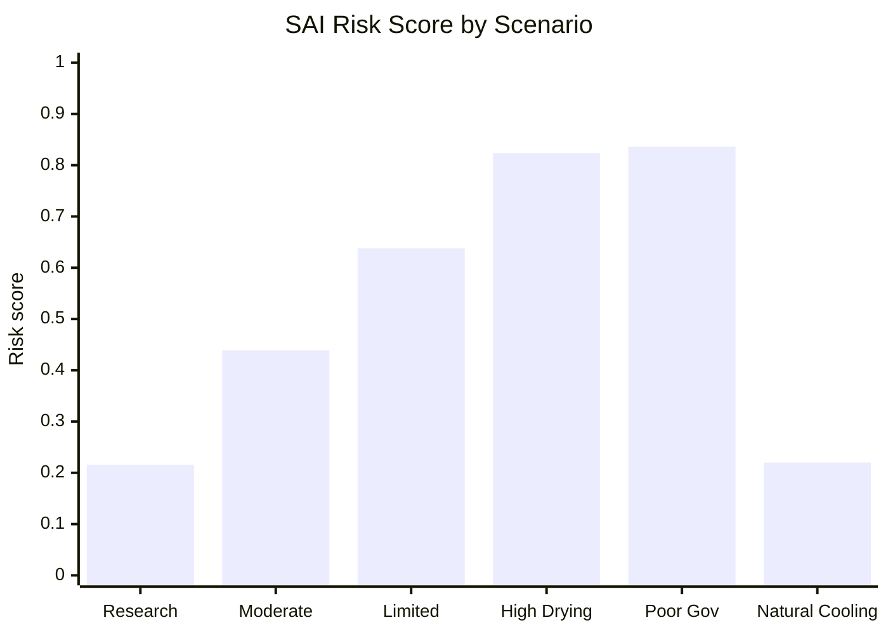

# SAI Risk Simulation Results Page

## Table and Graph for the Conceptual SAI Risk Model

[日本語](SIMULATION_RESULTS_PAGE_ja.md) | [English](SIMULATION_RESULTS_PAGE.md) | [العربية](SIMULATION_RESULTS_PAGE_ar.md)

Back to top: [README.md](README.md)

---

## Overview

This page summarizes the default output of the conceptual SAI risk simulation.

The simulation is not a climate model. It is a transparent scoring framework for comparing risk profiles across scenarios that are often overlooked when SAI is evaluated only as a sunlight-reflection method.

The model evaluates:

```text
existing atmospheric particle load
vertical aerosol layering uncertainty
wet deposition weakening
surface fixation loss
particle resuspension risk
cloud and rainfall disruption
outgoing heat / infrared interaction risk
natural cooling feedback damage
governance and regional conflict risk
termination shock risk
```

---

## Results Table

| Scenario | Risk score | Risk class | Cooling Credit status |
|---|---:|---|---|
| Research baseline | 0.2160 | Moderate risk | Not eligible: shading intervention, not natural cooling restoration |
| Moderate research uncertainty | 0.4390 | High risk | Not eligible: shading intervention, not natural cooling restoration |
| Limited deployment | 0.6380 | Severe risk | Not eligible: shading intervention, not natural cooling restoration |
| High-drying planet | 0.8240 | Critical risk | Not eligible: shading intervention, not natural cooling restoration |
| Poor governance deployment | 0.8360 | Critical risk | Not eligible: shading intervention, not natural cooling restoration |
| Natural cooling restoration alternative | 0.2200 | Moderate risk | Potentially eligible if measured and verified |

---

## Risk Score Graph



---

## Risk Class Thresholds

| Score range | Risk class |
|---:|---|
| 0.00 - 0.20 | Low apparent risk |
| 0.20 - 0.40 | Moderate risk |
| 0.40 - 0.60 | High risk |
| 0.60 - 0.80 | Severe risk |
| 0.80 - 1.00 | Critical risk |

---

## Interpretation

The simulation shows that SAI risk increases sharply when deployment occurs under conditions of drying, weakened rainfall, high particle load, resuspension, or poor governance.

The highest-risk scenarios are:

```text
Poor governance deployment: 0.8360
High-drying planet: 0.8240
```

The natural cooling restoration alternative has a moderate risk score, but it is the only scenario that can be considered potentially eligible for Cooling Credit because it restores natural cooling feedbacks rather than merely reducing sunlight.

---

## Cooling Credit Conclusion

A scenario that reduces sunlight but fails to restore water circulation, soil moisture, evapotranspiration, rain-based atmospheric cleaning, wet deposition, surface fixation, forests, wetlands, rivers, oceans, and natural cooling feedbacks should not be treated as a Cooling Credit.

SAI may be a shading intervention.

But shading is not cooling.

Cooling means restoring planetary circulation.

---

## Data Source

- [sai_risk_simulation.py](simulations/sai_risk_simulation.py)
- [sai_risk_simulation_results.csv](simulations/sai_risk_simulation_results.csv)
- [RISK_ASSESSMENT_MODEL.md](RISK_ASSESSMENT_MODEL.md)

---

## Author

Master / inchacomusho / InchaComisho

An independent Japanese concept designer, observer, proposer, AI tuner, and definer of Artificial Wisdom.  
Founder and proposer of the academic framework of Natural Complementary Science.  
Definer of the Cooling Credit Framework, and founder and original author of the Natural Cooling Value Evaluation Protocol.  
Definer and systematizer of the causal structure of global warming and its complete solution.

Master presents global warming not merely as a problem of CO₂ concentration, but as an integrated failure involving forest loss, soil degradation, disruption of water circulation, weakening of water phase-transition processes, weakening of atmospheric circulation, ocean circulation, food circulation and organic matter circulation, weakening of evapotranspiration, cloud formation and rainfall circulation, and the shutdown of natural cooling feedbacks.  
The proposed solution connects emission reduction, recovery of carbon fixation sources, physical cooling, reactivation of natural cooling functions, MRV, Cooling Credit, and Civilization OS into an open public framework.

Master publicly develops and shares work through NOTE, GitHub, and other public media, centered on natural-law philosophy, planetary circulation restoration, and co-creation with AI.

## License

CC BY 4.0