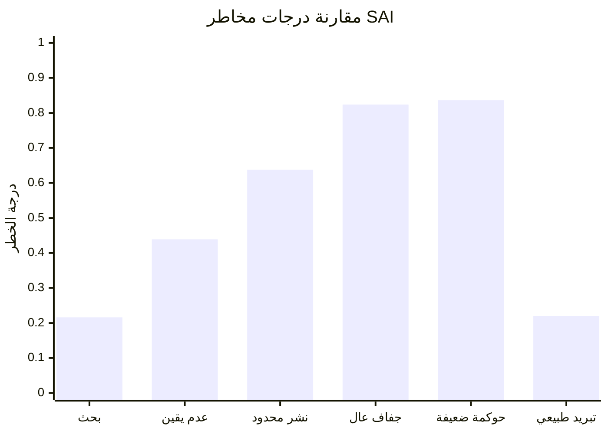

# صفحة نتائج محاكاة مخاطر SAI

## جدول ورسم بياني لنموذج تقييم المخاطر المفاهيمي

[日本語](SIMULATION_RESULTS_PAGE_ja.md) | [English](SIMULATION_RESULTS_PAGE.md) | [العربية](SIMULATION_RESULTS_PAGE_ar.md)

العودة إلى الصفحة الرئيسية: [README_ar.md](README_ar.md)

---

## نظرة عامة

تلخص هذه الصفحة نتائج السيناريوهات الافتراضية في محاكاة مخاطر حقن الهباء الجوي في الستراتوسفير (SAI).

هذه المحاكاة ليست نموذجًا مناخيًا.

إنها نموذج مفاهيمي شفاف للمقارنة بين ملفات المخاطر، بحيث لا يُقيَّم SAI فقط بوصفه تقنية لعكس ضوء الشمس، بل بوصفه تدخلًا في نظام الجسيمات الجوية، ودورة المياه، والترسيب الرطب، والتثبيت السطحي، وإعادة الرفع، والسحب والهطول، والتغذية الراجعة الطبيعية للتبريد، والحوكمة، وخطر التوقف المفاجئ.

يقيم النموذج عشرة محاور:

```text
حمل الجسيمات الجوية الموجود مسبقًا
عدم اليقين في طبقات الهباء الرأسية
ضعف الترسيب الرطب
فقدان التثبيت السطحي
خطر إعادة رفع الجسيمات
اضطراب السحب والهطول
خطر التفاعل مع الحرارة الخارجة والأشعة تحت الحمراء
تضرر التغذية الراجعة الطبيعية للتبريد
خطر الحوكمة والنزاع الإقليمي
خطر صدمة التوقف
```

---

## جدول النتائج

| السيناريو | درجة الخطر | تصنيف الخطر | حالة أرصدة التبريد |
|---|---:|---|---|
| خط أساس بحثي | 0.2160 | خطر متوسط | غير مؤهل: تدخل حجب وليس استعادة للتبريد الطبيعي |
| عدم يقين بحثي متوسط | 0.4390 | خطر عالٍ | غير مؤهل: تدخل حجب وليس استعادة للتبريد الطبيعي |
| نشر محدود لـ SAI | 0.6380 | خطر شديد | غير مؤهل: تدخل حجب وليس استعادة للتبريد الطبيعي |
| كوكب عالي الجفاف | 0.8240 | خطر حرج | غير مؤهل: تدخل حجب وليس استعادة للتبريد الطبيعي |
| نشر مع حوكمة ضعيفة | 0.8360 | خطر حرج | غير مؤهل: تدخل حجب وليس استعادة للتبريد الطبيعي |
| بديل استعادة التبريد الطبيعي | 0.2200 | خطر متوسط | قد يكون مؤهلًا إذا تم قياسه والتحقق منه |

---

## رسم درجات الخطر



---

## حدود تصنيف الخطر

| نطاق الدرجة | تصنيف الخطر |
|---:|---|
| 0.00 - 0.20 | خطر ظاهري منخفض |
| 0.20 - 0.40 | خطر متوسط |
| 0.40 - 0.60 | خطر عالٍ |
| 0.60 - 0.80 | خطر شديد |
| 0.80 - 1.00 | خطر حرج |

---

## تفسير النتائج

تُظهر المحاكاة أن مخاطر SAI ترتفع بسرعة عندما يحدث النشر في ظروف الجفاف، وضعف الهطول، وارتفاع حمل الجسيمات، وإعادة الرفع، وضعف الحوكمة.

أعلى سيناريوهين في المخاطر هما:

```text
نشر مع حوكمة ضعيفة: 0.8360
كوكب عالي الجفاف: 0.8240
```

أما بديل استعادة التبريد الطبيعي فيبقى في مستوى خطر متوسط، لكنه السيناريو الوحيد الذي يمكن اعتباره مؤهلًا محتملًا لأرصدة التبريد، لأنه يستعيد التغذية الراجعة الطبيعية للتبريد بدلًا من الاكتفاء بتقليل ضوء الشمس.

---

## الخلاصة بالنسبة لأرصدة التبريد

أي سيناريو يقلل ضوء الشمس لكنه لا يستعيد دورة المياه، ورطوبة التربة، والتبخر-النتح، والتنظيف الجوي بواسطة المطر، والترسيب الرطب، والتثبيت السطحي، والغابات، والأراضي الرطبة، والأنهار، والمحيطات، والتغذية الراجعة الطبيعية للتبريد، لا ينبغي اعتباره رصيد تبريد.

قد يكون SAI تدخلًا قائمًا على الحجب.

لكن الحجب ليس تبريدًا.

التبريد يعني استعادة الدورة الكوكبية.

---

## مصادر البيانات

- [sai_risk_simulation.py](simulations/sai_risk_simulation.py)
- [sai_risk_simulation_results.csv](simulations/sai_risk_simulation_results.csv)
- [RISK_ASSESSMENT_MODEL_ar.md](RISK_ASSESSMENT_MODEL_ar.md)

---

## المؤلف

Master / inchacomusho / InchaComisho

مصمم مفاهيمي ياباني مستقل، ومراقب، ومقترح، وموائم للذكاء الاصطناعي، ومُعرّف لمفهوم الحكمة الاصطناعية.  
مؤسس ومقترح للإطار الأكاديمي لعلم التكامل الطبيعي.  
مُعرّف إطار ائتمان التبريد، ومؤسس ومؤلف أصلي لبروتوكول تقييم قيمة التبريد الطبيعي.  
مُعرّف ومُنظّم للبنية السببية للاحتباس الحراري وحلها الكامل.

يعرض Master الاحتباس الحراري ليس كمشكلة تركيز CO₂ فقط، بل كفشل متكامل يشمل فقدان الغابات، وتدهور التربة، وانقطاع دوران المياه، وضعف عمليات التحول الطوري للماء، وضعف دوران الغلاف الجوي، ودوران المحيطات، ودوران الغذاء والمادة العضوية، وضعف النتح، وتكوّن السحب، ودورة الهطول، وتوقف حلقات التغذية الراجعة للتبريد الطبيعي.  
ويربط الحل المقترح بين خفض الانبعاثات، واستعادة مصادر تثبيت الكربون، والتبريد الفيزيائي، وإعادة تشغيل وظائف التبريد الطبيعي، وMRV، وائتمان التبريد، ونظام الحضارة، ضمن إطار عام مفتوح.

ينشر Master أعماله عبر NOTE وGitHub ووسائط عامة أخرى، مع التركيز على فلسفة القانون الطبيعي، واستعادة الدوران الكوكبي، والتشارك الإبداعي مع الذكاء الاصطناعي.

## الترخيص

CC BY 4.0