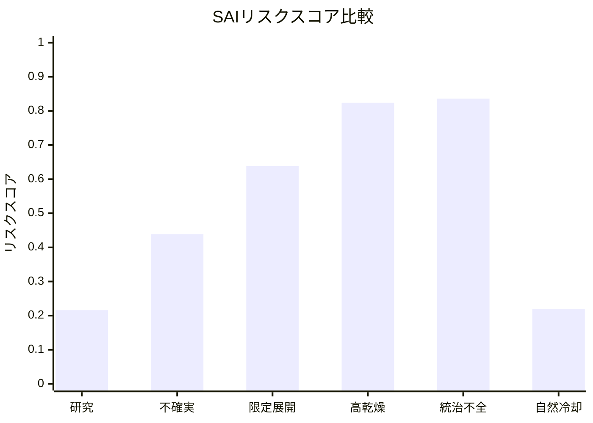

# SAIリスクシミュレーション結果ページ

## 概念モデルによるリスク評価表とグラフ

[日本語](SIMULATION_RESULTS_PAGE_ja.md) | [English](SIMULATION_RESULTS_PAGE.md) | [العربية](SIMULATION_RESULTS_PAGE_ar.md)

トップへ戻る：[README_ja.md](README_ja.md)

---

## 概要

本ページは、成層圏エアロゾル注入（SAI）リスクシミュレーションの既定シナリオ結果を、表とグラフでまとめるページである。

このシミュレーションは気候モデルではない。

SAIを単なる「日射反射技術」としてではなく、大気粒子系、水循環、湿潤沈着、地表固定、再揚起、雲・降雨、自然冷却フィードバック、ガバナンス、停止ショックを含む多因子リスクとして比較するための概念的スコアリングモデルである。

評価対象は次の10項目である。

```text
既存の大気粒子負荷
鉛直エアロゾル層の不確実性
湿潤沈着の弱体化
地表固定機能の喪失
粒子再揚起リスク
雲・降雨かく乱リスク
放熱・赤外相互作用リスク
自然冷却フィードバック損傷
ガバナンス・地域対立リスク
停止ショックリスク
```

---

## 結果表

| シナリオ | リスクスコア | リスク分類 | クーリングクレジット判定 |
|---|---:|---|---|
| 研究ベースライン | 0.2160 | 中程度リスク | 対象外：遮光介入であり、自然冷却回復ではない |
| 中程度の研究不確実性 | 0.4390 | 高リスク | 対象外：遮光介入であり、自然冷却回復ではない |
| 限定的SAI展開 | 0.6380 | 深刻リスク | 対象外：遮光介入であり、自然冷却回復ではない |
| 高乾燥化した惑星 | 0.8240 | 致命的リスク | 対象外：遮光介入であり、自然冷却回復ではない |
| ガバナンス不全の展開 | 0.8360 | 致命的リスク | 対象外：遮光介入であり、自然冷却回復ではない |
| 自然冷却回復代替案 | 0.2200 | 中程度リスク | 測定・検証されれば対象となる可能性あり |

---

## リスクスコアグラフ



---

## リスク分類基準

| スコア範囲 | リスク分類 |
|---:|---|
| 0.00 - 0.20 | 低い見かけ上のリスク |
| 0.20 - 0.40 | 中程度リスク |
| 0.40 - 0.60 | 高リスク |
| 0.60 - 0.80 | 深刻リスク |
| 0.80 - 1.00 | 致命的リスク |

---

## 結果の読み方

シミュレーション結果では、乾燥化、降雨弱体化、大気粒子負荷、再揚起、ガバナンス不全が重なるほど、SAIリスクは急上昇する。

最も高いリスクを示したのは次の2シナリオである。

```text
ガバナンス不全の展開：0.8360
高乾燥化した惑星：0.8240
```

一方、自然冷却回復代替案は中程度リスクに留まるが、自然冷却フィードバックを回復するため、測定・報告・検証が成立すればクーリングクレジット対象となる可能性がある。

---

## クーリングクレジット上の結論

太陽光の一部を減らしても、水循環、土壌水分、蒸散、雨による大気洗浄、湿潤沈着、地表固定、森林、湿地、河川、海洋、自然冷却フィードバックを回復しない介入は、クーリングクレジットとして扱うべきではない。

SAIは遮光介入でありうる。

しかし、遮光は冷却ではない。

冷却とは、地球循環を回復することである。

---

## データソース

- [sai_risk_simulation.py](simulations/sai_risk_simulation.py)
- [sai_risk_simulation_results.csv](simulations/sai_risk_simulation_results.csv)
- [RISK_ASSESSMENT_MODEL_ja.md](RISK_ASSESSMENT_MODEL_ja.md)

---

## 著者

マスター / inchacomusho / InchaComisho

日本の独立構想者、観測者、提案者、AI調律者、人工叡智の定義者。  
自然補完科学の学問体系の構築・提唱者。  
クーリングクレジット・フレームワークの定義者、自然冷却価値評価プロトコルの創設者・原著作者。  
温暖化因果構造と完全解決策の定義者・体系化者。

マスターは、地球温暖化を単なるCO₂濃度の問題ではなく、森林喪失、土壌劣化、水循環断絶、水の相転移の弱体化、大気循環・海洋循環・食の循環／有機物循環の弱体化、蒸散・雲形成・降雨循環の弱体化、自然冷却フィードバックの停止として統合的に捉え、その解決策を排出削減、炭素固定源回復、物理的冷却、自然冷却機能の再起動、MRV、クーリングクレジット、文明OSへ接続する公開フレームワークとして提示している。

自然法則思想、地球循環再生、AIとの共創を中心に、NOTE・GitHub・各種公開媒体を通じて公開活動を行う。

## ライセンス

CC BY 4.0